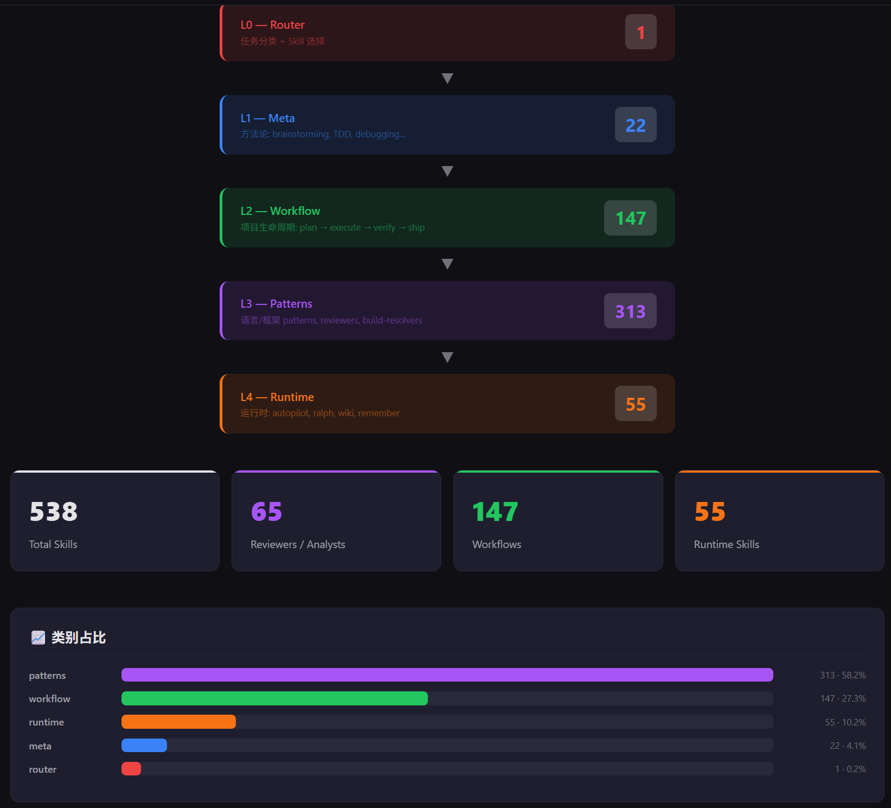

# CSP — Code Skills Package

<div align="center">

[](./LICENSE)
[](https://www.npmjs.com/package/code-skills-package)
[](./CHANGELOG.md)(./CHANGELOG.md)
[](./docs/SKILL-INDEX.md)
[](./docs/INSTALL.md)

**Unified AI Programming Skills · 22+ Platforms · 15+ Languages · 653 Skills**

Integrates capabilities from multiple open-source AI coding projects into a layered, auto-routing framework with extremely low token costs to complete complex development tasks.

[Quick Start](#quick-start) · [Core Features](#core-features) · [Architecture](#architecture) · [English](./README.md)

</div>

---

<div align="center">

[](https://maythyai.github.io/code-skills-package/)

**🔗 [Live Interactive Dashboard](https://maythyai.github.io/code-skills-package/)** — explore all 653 skills by layer, category, and triggers

</div>

CSP (Code Skills Package) consolidates the essence of multiple open-source AI programming projects into an integrated solution. It uses a five-layer architecture to load skills on demand, with confidence scoring router and skill knowledge graph, allowing AI programming assistants to load only the minimum skill set required for each task during a session. At the same time, CSP remembers user usage habits and project context, providing increasingly accurate services as the project evolves. With 653 skills spanning full-stack development, DevOps, security, and a dedicated indie developer toolkit covering deployment, monetization, performance, and more, CSP supports the complete journey from idea to production.

## Core Features

| Feature | CSP Solution | Traditional Solution |
|---------|--------------|---------------------|
| **Smart Routing** | Confidence scoring + state awareness + knowledge graph, automatically selects optimal skill combinations | Manual plugin selection / full loading |
| **Token Savings** | Five-layer on-demand loading + index sharding, ~500–1,500 tokens per task | Full loading ~12,000+ tokens |
| **Skill Orchestration** | Static Recipe + Dynamic DAG, supports branching / parallel / rollback / automatic merging | Fixed pipeline / no orchestration |
| **Continuous Learning** | 5-dimensional knowledge extraction, gets smarter about projects and developers | Stateless, starts from zero each time |
| **Full-Stack Coverage** | 653 skills · 5 layers · 15+ languages · 22+ platforms | Single language / limited scenarios |
| **Open Extension** | Custom Skills + Recipe + Creation Wizard | Closed ecosystem / no extension |

### Smart Routing

The router uses triple-signal weighted scoring (keywords 40% + intent 30% + context 30%), combined with Git status, technology stack and development phase auto-detection, along with the SKPG skill knowledge graph (740 nodes, 795 edges, 162 trigger keywords) for dependency checking and path optimization. High confidence routes directly, low confidence uses interactive confirmation.

### On-Demand Loading Architecture

Only L0 router remains resident (~2,000 tokens (SKILL.md + routing index summary)), L1–L4 loads on demand. Index sharding reduces resident tokens by ~85%, dynamic unloading and shared context further reduce long session overhead. Per-task token consumption controlled to ~500–1,500.

### Skill Orchestration Engine

Two orchestration modes complement each other: Static Recipe pre-defines skill sequences for common scenarios (feature development, bug fixes, refactoring, quick fixes); Dynamic DAG engine `csp-auto` makes node-by-node decisions, supporting branching parallelism, rollback retries and worktree isolation execution. Complexity classifier automatically matches model tiers.

### Continuous Learning Engine

Automatically extracts knowledge in 5 dimensions at session end — project architecture and tech stack, user requirement patterns, developer coding style and preferences, long-term lessons learned, skill usage feedback. Knowledge persisted to `.csp/intel/`, reused across sessions, making CSP increasingly accurate as projects evolve.

### Full Development Lifecycle Coverage

653 skills distributed across 5 layers, covering the full process of requirement planning, code implementation, review, debugging, testing, and release, extending to specialized areas such as AI Engineering (RAG/LLM/vLLM), DevOps (CI/CD/IaC/K8s), mobile (React Native/cross-platform), security auditing (STRIDE-A/CodeQL/incident response). Additionally, 31 skills are specifically designed for independent developers, covering deployment (Vercel/Railway/VPS), monetization (Stripe/subscriptions/SEO/analytics), performance tuning, API integration (webhooks/OAuth), testing engineering (E2E/visual regression), internationalization, and monorepo management. Each skill follows the SKILL.md v2 specification, with structured fields like phase/domain/role.

### Open Ecosystem

Users can define custom workflows via `.csp/recipes.yaml`, create new skills interactively with `csp-skill-creator`. Installer supports selective deployment by tech stack (`--stacks`) and layer (`--layers`), with `--minimal` mode installing only the core router.

### Common Workflows

| Scenario | Input Example | Skill Chain |
|----------|---------------|-------------|
| **Feature Development** | "Develop user authentication feature" | brainstorming → spec → plan → execute → tdd → review → verify → ship |
| **Bug Fix** | "There's a bug in this Django project" | debug + django-patterns → fix → tdd → verify |
| **Code Review** | "Help me do a code review" | code-review + language reviewer → REVIEW.md |
| **Requirements Clarification** | "I want to build something but not sure" | interview-me → brainstorming → spec |
| **Project Onboarding** | "I just took over this project" | explore → map-codebase → architecture mapping |
| **Quick Prototyping** | "Quickly make a demo" | brainstorming → implement → basic-check |
| **Security Audit** | "Conduct security review" | security-review + framework security skill → audit report |
| **Deploy to Production** | "Deploy my app to Vercel" | platform-deploy + indie-deploy-ops → live app |
| **Add Payments** | "Integrate Stripe subscriptions" | payment-integration + subscription-management + webhook-architecture |
| **Performance Tuning** | "My app is slow" | frontend-performance + backend-performance + db-performance |
| **Go International** | "Add multi-language support" | i18n-frameworks + locale-management → localized app |

## Quick Start

### Installation

```bash
# Auto-detect AI tool and install
./install.sh

# Install for a specific platform (22 supported)
./install.sh --platform claude-code
./install.sh --platform cursor

# Install into any target directory (no need to clone this project here)
./install.sh --platform cursor --target /path/to/your/project

# Remote one-line install (no clone required)
curl -fsSL https://raw.githubusercontent.com/maythyai/code-skills-package/master/install.sh | bash -s -- --platform cursor

# Remote install to a specific target directory
curl -fsSL https://raw.githubusercontent.com/maythyai/code-skills-package/master/install.sh | bash -s -- --platform cursor --target /path/to/your/project

# npm global install
npm install -g code-skills-package
cd /your/project && csp-install --platform cursor

# Global install
./install.sh --platform trae --global

# Uninstall
./install.sh --uninstall

# List detected platforms
./install.sh --list
```

Complete installation documentation: [INSTALL.md](./docs/INSTALL.md) · Update Guide: [UPDATE.md](./docs/UPDATE.md)

## Usage

### Natural Language (Recommended)

Add to your project `CLAUDE.md`:

```markdown
Use CSP (Code Skills Package) skills. When given a task, route to the appropriate skill combination via csp-router.
```

After that, simply give tasks to AI normally, the router will work automatically:

| Input | Result |
|-------|--------|
| `"Do a code review"` | Loads `csp-code-review` + language-specific reviewer |
| `"Plan and implement user auth"` | brainstorming → spec → plan → execute → tdd → review → verify → ship |
| `"There's a bug in this Django project"` | Loads `csp-debug` + `csp-django-patterns` |

### Slash Commands

```bash
/csp-plan          # Planning phase
/csp-debug         # Debugging flow
/csp-review        # Code review
/csp-test          # Testing flow
/csp-ship          # Release flow
/csp-spec-phase    # Requirements clarification
/csp-execute-phase # Execute plan
/csp-verify        # Verify implementation
/csp-search <query> # Search skill index
```

### Direct Invocation

```markdown
Load csp-react-reviewer to review this code
Load csp-plan-phase to plan this feature
```

## Architecture

CSP uses a five-layer layered architecture. Only the router (L0) loads at session start, remaining layers load on demand.

```
┌──────────────────────────────────────────────────────────────┐
│  L0  csp-router      Session-start resident (~2,000 tokens)  │
│      Task classification + confidence scoring + state        │
│      awareness + SKPG knowledge graph enhancement            │
├──────────────────────────────────────────────────────────────┤
│  L1  csp-meta        Methodology (~300 tokens/skill · 25)  │
│      Planning · Debugging · TDD · Brainstorming · Scope Guard│
├──────────────────────────────────────────────────────────────┤
│  L2  csp-workflow    Project management (~500 tokens/skill  │
│      · 185) plan → execute → verify → ship full lifecycle   │
├──────────────────────────────────────────────────────────────┤
│  L3  csp-patterns    Language/Framework (~200-600 tokens    │
│      · 380) 15+ reviewer · Build fix · Patterns · Security │
│      · Indie Dev (deploy/monetization/perf/i18n/monorepo)  │
│      · Responsive/Data-analysis/Paper-reader/UI-design      │
├──────────────────────────────────────────────────────────────┤
│  L4  csp-runtime     Runtime (~300 tokens/skill · 58)      │
│      Continuous learning · Autonomous execution · Knowledge  │
│      management · Token budget · File-organizer · Parallel   │
└──────────────────────────────────────────────────────────────┘
                    Total: 653 skills
```

### Routing Process

```
User input → State detection (Git/tech stack/phase)
         → Keywords + Intent + Regex pattern matching
         → Confidence scoring (keyword×0.4 + intent×0.3 + context×0.3)
         → SKPG dependency check
         → Routing decision
```

| Confidence | Decision |
|------------|----------|
| > 80% | Directly route to top skill |
| 50–80% | Show top 3, let user confirm |
| < 50% | Fall back to deep interview (`/csp-interview-me`) |

### Token Saving Strategy

| Strategy | Effect |
|----------|--------|
| Index sharding (on-demand loading by node type) | Resident tokens reduced by ~85% |
| Summary caching (~30 tokens/skill per line) | Avoid repeated loading, reduce 15% |
| Dynamic unloading (release L3/L4 content after completion) | Long sessions reduced by 30% |
| Shared context (pass via `.csp/artifacts/`) | Cross-skill calls reduced by 20% |

Detailed architecture design, DAG orchestration engine, skill knowledge graph, skill retrieval strategy, etc., please refer to [ARCHITECTURE.md](./docs/ARCHITECTURE.md).

## Skill Orchestration

CSP supports two complementary orchestration modes: static Recipes (pre-defined sequences) and dynamic DAG (`csp-auto` makes node-by-node decisions).

### Built-in Recipes

```yaml
# New feature development
feature-development:
  sequence: [brainstorming → plan → spec → implement → tdd → review → verify → ship]

# Bug fix
bug-fix:
  sequence: [debug → implement → tdd(regression) → verify]

# Refactoring
refactor:
  sequence: [review(analyze) → plan → implement → tdd(no-regression) → review(verify)]

# Quick fix
quick-fix:
  sequence: [implement → verify(quick-check)]
```

### Custom Recipes

Define reusable workflows by creating `.csp/recipes.yaml` in the project root:

```yaml
recipes:
  hotfix:
    description: "Urgent production fix, minimize changes"
    triggers: ["hotfix", "urgent"]
    sequence:
      - skill: csp-debug
      - skill: csp-implement
        mode: minimal-change
      - skill: csp-verify-phase
        mode: regression-only
      - skill: csp-ship
        auto: true
```

Recipe priority: user-defined → built-in → router's dynamic composition.

## Troubleshooting

```bash
/csp-why            # Why was this skill chosen?
/csp-debug-router   # Router matching logs
/csp-stats          # Usage statistics
```

## Platform Support

CSP supports 22+ AI programming platforms, including Claude Code, Cursor, Trae, Windsurf, Kiro, Codex, Gemini CLI, **JetBrains (Junie)**, **Cline**, **Roo Code**, **Neovim (avante.nvim)**, etc. The installation script automatically detects the platform and generates corresponding configuration files (CLAUDE.md / .cursorrules / .windsurfrules / .junie/guidelines.md / .cline/rules / .roo/rules / .avante/rules, etc.).

## Engineering & Supply-Chain Safety

For contributors and security-conscious installers:

```bash
# Full rebuild of all derived data from SKILL.md frontmatter
npm run build:all     # registry → metadata → triggers → graph → page

# Validate skills + triggers + registry schema
npm run validate:all

# Full test suite (validate + graph rebuild + 20 invariant assertions)
npm test

# Scaffold a new validate-passing skill
node bin/csp-sdk.mjs init-skill csp-my-skill --layer 3 --phase build
```

- **`install.sh`** is split into `install.sh` + `lib/platforms.sh` + `lib/bootstrap.sh` for maintainability.
- **Remote bootstrap integrity**: set `CSP_SHA256=<hash>` to verify the downloaded archive (the hash is printed on every install so you can pin it). `CSP_BRANCH` is whitelisted against `^[A-Za-z0-9._-]+$` to prevent command injection.
- **Single source of truth**: `SKILL.md` frontmatter (v2 fields) → all of `registry.json` / `triggers.yaml` / `skpg/graph.json` / `skill-metadata.yaml` are derived — never hand-edit them.
- See [CLAUDE.md](./CLAUDE.md) for the engineering pipeline and [docs/analysis/project-review-2026-08.md](./docs/analysis/project-review-2026-08.md) for the multi-dimensional audit.

## Further Reading

| Document | Description |
|----------|-------------|
| [ARCHITECTURE.md](./docs/ARCHITECTURE.md) | Complete architecture design (14 chapters · DAG orchestration · SKPG · Token strategy) |
| [SKILL-INDEX.md](./docs/SKILL-INDEX.md) | Complete index of 653 skills/agents |
| [INSTALL.md](./docs/INSTALL.md) | Complete installation guide (22+ platforms) |
| [UPDATE.md](./docs/UPDATE.md) | How to keep an installed skill package up to date |
| [SKILL-AUTHORING.md](./docs/SKILL-AUTHORING.md) | Skill authoring best practices |
| [SKILL-SPEC.md](./docs/SKILL-SPEC.md) | SKILL.md specification document |
| [VERSIONING.md](./docs/VERSIONING.md) | Version management policy (X=arch, Y=feature, Z=fix) |
| [USER-GUIDE.md](./docs/USER-GUIDE.md) | User guide |
| [examples/](./examples/README.md) | Five worked examples (code review, security review, build-fix, simplification, dashboard) |
| [scripts/](./scripts/README.md) | Build / validation / maintenance tooling reference |
| [CONTRIBUTING.md](./CONTRIBUTING.md) | How to contribute a skill or fix |
| [CHANGELOG.md](./CHANGELOG.md) | Release history |
| [docs/analysis/](./docs/analysis/project-review-2026-08.md) | Audit reports and cross-layer testing case study |
| [README_zh.md](./README_zh.md) | Chinese Documentation |

## License

[MIT License](./LICENSE)

All integrated projects use the MIT license.

## Acknowledgments

CSP integrates capabilities from the following open-source projects:

| Project | Contribution Area |
|---------|------------------|
| [ECC](https://github.com/burningion/video-editing-ai) | Skill library |
| [GSD](https://github.com/benjiwoss/get-shit-done) | Project management & lifecycle workflows |
| [OMC](https://github.com/ruvcode/oh-my-claudecode) | Runtime enhancement (autopilot · wiki · remember) |
| [Superpowers](https://github.com/SimpleVibe/Superpowers) | Meta-skills & methodology |
| [spec-kit](https://github.com/microsoft/spec-kit) | Spec-driven development |
| [Agency-Agents](https://github.com/msitarzewski/agency-agents) | Specialized AI agents |
| [awesome-copilot](https://github.com/github/awesome-copilot) | GitHub Copilot skills & agents (~40 selected) |
