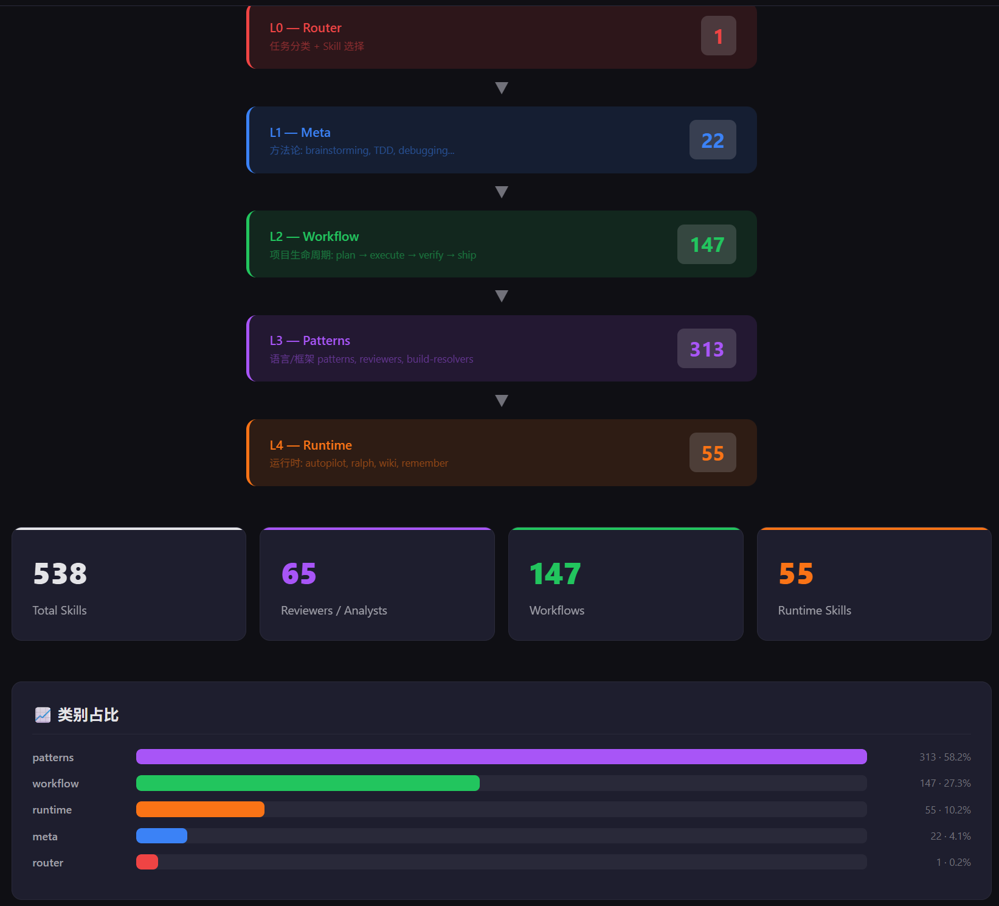

# CSP — Code Skills Package

<div align="center">

[](./LICENSE)
[](https://www.npmjs.com/package/code-skills-package)
[](./CHANGELOG.md)
[](./SKILL-INDEX.md)
[](./docs/INSTALL.md)

**统一 AI 编程技能 · 18+ 个平台 · 15+ 语言 · 584 个技能**

整合多个开源 AI 编程项目为分层自动路由框架，以极低的 token 成本完成复杂开发任务。

[快速开始](#快速开始) · [核心亮点](#核心亮点) · [架构](#架构) · [English](./README.md)

</div>

---

<div align="center">

[](https://maythyai.github.io/code-skills-package/)

**🔗 [在线交互式仪表盘](https://maythyai.github.io/code-skills-package/)** — 按层级、分类、触发词浏览全部 584 个技能

</div>

CSP（Code Skills Package）将多个开源 AI 编程项目的精华整合为一体化解决方案。它通过五层架构按需加载技能，配合置信度评分路由器和技能知识图谱，让 AI 编程助手在每次会话中只加载任务所需的最小 skill 集合。同时，CSP 会记忆用户的使用习惯和项目上下文，随着项目演进提供越来越精准的服务。584 个技能覆盖全栈开发、DevOps、安全审计等领域，并专为独立开发者提供部署运维、商业化运营、性能调优、国际化、Monorepo 管理等专项技能包，支持从 idea 到 production 的完整旅程。

## 核心亮点

| 亮点 | CSP 方案 | 传统方案 |
|------|----------|----------|
| **智能路由** | 置信度评分 + 状态感知 + 知识图谱，自动选择最优技能组合 | 手动选插件 / 全量加载 |
| **Token 节约** | 五层按需加载 + 索引分片，单次任务 ~500–1,500 tokens | 全量加载 ~12,000+ tokens |
| **技能编排** | 静态 Recipe + 动态 DAG，支持分支 / 并行 / 回退 / 自动合并 | 固定流水线 / 无编排 |
| **持续学习** | 5 维度知识提取，越用越懂项目和开发者 | 无状态，每次从零开始 |
| **全栈覆盖** | 584 技能 · 5 层级 · 15+ 语言 · 18+ 平台 | 单一语言 / 有限场景 |
| **开放扩展** | 自定义 Skill + Recipe + 创作向导 | 封闭生态 / 无扩展 |

### 智能路由

路由器采用三信号加权评分（关键词 40% + 意图 30% + 上下文 30%），结合 Git 状态、技术栈和开发阶段自动感知，配合 SKPG 技能知识图谱（740 节点、795 边、162 个触发词）进行依赖检查和路径优化。高置信度直接路由，低置信度交互式确认。

### 按需加载架构

仅 L0 路由器常驻（~800 tokens），L1–L4 按需加载。索引分片将常驻 token 减少 98%，动态卸载和共享上下文进一步降低长会话开销。单次任务 token 消耗控制在 ~500–1,500。

### 技能编排引擎

两种编排模式互补：静态 Recipe 为常见场景（功能开发、Bug 修复、重构、快速修复）预定义技能序列；动态 DAG 引擎 `csp-auto` 逐节点决策，支持分支并行、回退重试和 worktree 隔离执行。复杂度分类器自动匹配模型档位。

### 持续学习引擎

会话结束时自动提取 5 个维度的知识——项目架构与技术栈、用户需求模式、开发者编码风格与偏好、长期经验教训、技能使用反馈。知识持久化到 `.csp/intel/`，跨会话复用，让 CSP 随着项目演进越来越精准。

### 全开发生命周期覆盖

584 个技能分布在 5 个层级，覆盖需求规划、代码实现、审查、调试、测试、发布全流程，并延伸至 AI 工程（RAG/LLM/vLLM）、DevOps（CI/CD/IaC/K8s）、移动端（React Native/跨平台）、安全审计（STRIDE-A/CodeQL/事件响应）等专业领域。此外，31 个技能专为独立开发者设计，覆盖部署运维（Vercel/Railway/VPS）、商业化运营（Stripe/订阅/SEO/分析）、性能调优、API 集成（Webhook/OAuth）、测试工程（E2E/视觉回归）、国际化和 Monorepo 管理。每个技能遵循 SKILL.md v2 规范，含 phase/domain/role 等结构化字段。

### 开放生态

用户可通过 `.csp/recipes.yaml` 自定义工作流，用 `csp-skill-creator` 交互式创建新技能。安装器支持按技术栈（`--stacks`）和层级（`--layers`）选择性部署，`--minimal` 模式仅安装核心路由器。

### 常见工作流

| 场景 | 输入示例 | 技能链 |
|------|----------|--------|
| **功能开发** | "开发用户认证功能" | brainstorming → spec → plan → execute → tdd → review → verify → ship |
| **Bug 修复** | "这个 Django 项目有个 bug" | debug + django-patterns → fix → tdd → verify |
| **代码审查** | "帮我做个 code review" | code-review + 语言 reviewer → REVIEW.md |
| **需求澄清** | "我想做个什么，但不太确定" | interview-me → brainstorming → spec |
| **接手新项目** | "我刚接手这个项目" | explore → map-codebase → 架构映射 |
| **快速原型** | "快速做一个 demo" | brainstorming → implement → basic-check |
| **安全审计** | "进行安全审查" | security-review + 框架安全 skill → 审查报告 |
| **部署上线** | "把应用部署到 Vercel" | platform-deploy + indie-deploy-ops → 线上应用 |
| **接入支付** | "集成 Stripe 订阅支付" | payment-integration + subscription-management + webhook-architecture |
| **性能优化** | "应用太慢了" | frontend-performance + backend-performance + db-performance |
| **国际化** | "添加多语言支持" | i18n-frameworks + locale-management → 本地化应用 |

## 快速开始

### 安装

```bash
# 自动检测 AI 工具并安装
./install.sh

# 指定平台安装（支持 18 个平台）
./install.sh --platform claude-code
./install.sh --platform cursor

# 安装到任意目标目录（无需克隆本项目）
./install.sh --platform cursor --target /path/to/your/project

# 一行远程安装
curl -fsSL https://raw.githubusercontent.com/maythyai/code-skills-package/master/install.sh | bash -s -- --platform cursor

# npm 全局安装
npm install -g code-skills-package
cd /your/project && csp-install --platform cursor

# 选择性安装
./install.sh --stacks python,typescript    # 按技术栈过滤
./install.sh --layers router,meta          # 按层级选择性安装
./install.sh --minimal                     # 仅 router + meta（<20% 总量）
./install.sh --dry-run                     # 预览不执行

# 卸载
./install.sh --uninstall
./install.sh --uninstall --global
```

完整安装文档见 [INSTALL.md](./docs/INSTALL.md) · 更新指南见 [UPDATE.md](./docs/UPDATE.md)

## 使用方式

### 自然语言（推荐）

在项目 `CLAUDE.md` 中添加一行即可开始使用：

```markdown
使用 CSP (Code Skills Package) 技能包。当用户给出任务时，先通过 csp-router 路由到合适的 skill 组合。
```

之后正常给 AI 下任务即可，路由器会自动工作：

| 输入 | 结果 |
|------|------|
| `"帮我做个 code review"` | 加载 `csp-code-review` + 语言专项 reviewer |
| `"规划并实现用户认证功能"` | brainstorming → spec → plan → execute → tdd → review → verify → ship |
| `"这个 Django 项目有个 bug"` | 加载 `csp-debug` + `csp-django-patterns` |

### 斜杠命令

```bash
/csp-plan          # 规划阶段
/csp-debug         # 调试流程
/csp-review        # 代码审查
/csp-test          # 测试流程
/csp-ship          # 发布流程
/csp-spec-phase    # 需求澄清
/csp-execute-phase # 执行计划
/csp-verify        # 验证实现
/csp-search <query> # 搜索 skill 索引
/csp-why           # 解释路由决策
/csp-stats         # 使用统计
```

### 直接调用

```markdown
加载 csp-react-reviewer 审查这段代码
加载 csp-plan-phase 规划这个功能
```

## 架构

CSP 采用五层分层架构。仅路由器（L0）在会话启动时加载，其余层级按需加载。

```
┌──────────────────────────────────────────────────────────────┐
│  L0  csp-router      会话启动常驻（~800 tokens）              │
│      任务分类 + 置信度评分 + 状态感知 + SKPG 知识图谱增强      │
├──────────────────────────────────────────────────────────────┤
│  L1  csp-meta        方法论（~300 tokens/skill · ~24 个）     │
│      规划 · 调试 · TDD · 头脑风暴 · 范围控制                   │
├──────────────────────────────────────────────────────────────┤
│  L2  csp-workflow    项目管理（~500 tokens/skill · ~150 个）  │
│      plan → execute → verify → ship 全生命周期                 │
├──────────────────────────────────────────────────────────────┤
│  L3  csp-patterns    语言/框架（~200-600 tokens · ~338 个）   │
│      15+ reviewer · 构建修复 · patterns · 安全审查             │
│      · 独立开发者（部署/商业化/性能/i18n/monorepo）            │
├──────────────────────────────────────────────────────────────┤
│  L4  csp-runtime     运行时（~300 tokens/skill · ~55 个）     │
│      持续学习 · 自主执行 · 知识管理 · Token 预算 · 并行编排    │
└──────────────────────────────────────────────────────────────┘
                    总计：584 个技能
```

### 路由流程

```
用户输入 → 状态检测(Git/技术栈/阶段)
         → 关键词 + 意图 + 正则模式匹配
         → 置信度评分(keyword×0.4 + intent×0.3 + context×0.3)
         → SKPG 依赖检查
         → 路由决策
```

| 置信度 | 决策 |
|--------|------|
| > 80% | 直接路由到 top skill |
| 50–80% | 展示 top 3，让用户确认 |
| < 50% | 回退到深度访谈 (`/csp-interview-me`) |

### Token 节约策略

| 策略 | 效果 |
|------|------|
| 索引分片（按节点类型按需加载） | 常驻 token 减少 98% |
| 摘要缓存（单行 ~30 tokens/skill） | 避免重复加载，减少 15% |
| 动态卸载（完成后释放 L3/L4 正文） | 长会话减少 30% |
| 共享上下文（`.csp/artifacts/` 传递） | 跨 skill 调用减少 20% |

详细的架构设计、DAG 编排引擎、技能知识图谱、Skill 检索策略等内容，请参阅 [ARCHITECTURE_zh.md](./docs/ARCHITECTURE_zh.md)。

## 技能编排

CSP 支持静态 Recipe（预定义序列）和动态 DAG（`csp-auto` 逐节点决策）两种编排模式。

### 内置 Recipe

```yaml
# 新功能开发
feature-development:
  sequence: [brainstorming → plan → spec → implement → tdd → review → verify → ship]

# Bug 修复
bug-fix:
  sequence: [debug → implement → tdd(regression) → verify]

# 代码重构
refactor:
  sequence: [review(分析) → plan → implement → tdd(no-regression) → review(验证)]

# 快速修复
quick-fix:
  sequence: [implement → verify(quick-check)]
```

### 自定义 Recipe

在项目根目录创建 `.csp/recipes.yaml` 定义可复用工作流：

```yaml
recipes:
  hotfix:
    description: "紧急生产修复，最小化变更"
    triggers: ["hotfix", "紧急"]
    sequence:
      - skill: csp-debug
      - skill: csp-implement
        mode: minimal-change
      - skill: csp-verify-phase
        mode: regression-only
      - skill: csp-ship
        auto: true
```

Recipe 优先级：用户自定义 → 内置 → 路由器动态组合。

## 故障排查

```bash
/csp-why            # 为什么选择了这个 skill？
/csp-debug-router   # 路由器匹配日志
/csp-stats          # 使用统计
```

## 平台支持

CSP 支持 18+ 个 AI 编程平台，包括 Claude Code、Cursor、Trae、Windsurf、Kiro、Codex、Gemini CLI 等。安装脚本会自动检测平台并生成对应配置文件（CLAUDE.md / .cursorrules / .windsurfrules 等）。

## 进一步阅读

| 文档 | 说明 |
|------|------|
| [ARCHITECTURE_zh.md](./docs/ARCHITECTURE_zh.md) | 完整架构设计（11 章 · DAG 编排 · SKPG · Token 策略） |
| [SKILL-INDEX.md](./SKILL-INDEX.md) | 全部 584 个 skill/agent 索引 |
| [INSTALL.md](./docs/INSTALL.md) | 完整安装指南（18+ 平台） |
| [SKILL-AUTHORING.md](./docs/SKILL-AUTHORING.md) | Skill 编写最佳实践 |
| [SKILL-SPEC.md](./docs/SKILL-SPEC.md) | SKILL.md 规范文档 |
| [USER-GUIDE.md](./docs/USER-GUIDE.md) | 用户使用指南 |
| [README.md](./README.md) | English Documentation |

## 许可证

[MIT License](./LICENSE) — CSP 整合的项目均采用 MIT 许可证。

## 鸣谢

CSP 整合了以下开源项目的精华：

| 项目 | 贡献领域 |
|------|----------|
| [ECC](https://github.com/burningion/video-editing-ai) | Skill 库 |
| [GSD](https://github.com/benjiwoss/get-shit-done) | 项目管理与生命周期工作流 |
| [OMC](https://github.com/ruvcode/oh-my-claudecode) | 运行时增强（autopilot · wiki · remember） |
| [Superpowers](https://github.com/SimpleVibe/Superpowers) | 元技能与方法论 |
| [spec-kit](https://github.com/microsoft/spec-kit) | 规范驱动开发 |
| [Agency-Agents](https://github.com/msitarzewski/agency-agents) | 专业化 AI agents |
| [awesome-copilot](https://github.com/github/awesome-copilot) | GitHub Copilot skills & agents（~40 个精选融入） |
