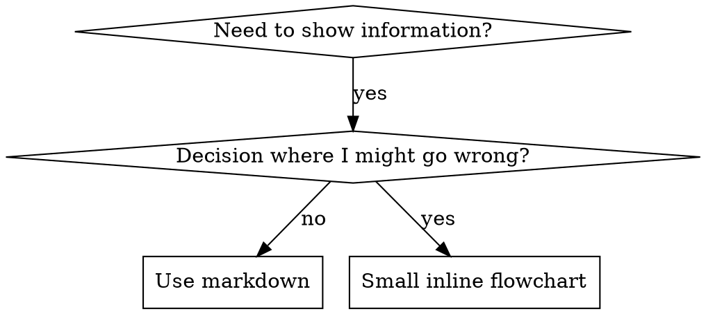

| TDD Concept | Skill Equivalent |
|-------------|------------------|
| **Test case** | Pressure scenario with subagent |
| **Production code** | Skill document (SKILL.md) |
| **Test fails (RED)** | Agent violates rule without skill (baseline) |
| **Test passes (GREEN)** | Agent complies with skill present |
| **Refactor** | Close loopholes while maintaining compliance |
| **Write test first** | Run baseline scenario BEFORE writing skill |
| **Watch it fail** | Document exact rationalizations agent uses |
| **Minimal code** | Write skill addressing those specific violations |
| **Watch it pass** | Verify agent now complies |
| **Refactor cycle** | Find new rationalizations, plug, re-verify |

The entire skill creation process follows RED-GREEN-REFACTOR.

## When to Create a Skill

**Create when:**
- Technique wasn't intuitively obvious to you
- You'd reference this again across projects
- Pattern applies broadly (not project-specific)
- Others would benefit

**Don't create for:**
- One-off solutions
- Standard practices well-documented elsewhere
- Project-specific conventions (put in CLAUDE.md)
- Mechanical constraints (if it's enforceable with regex/validation, automate it — save documentation for judgment calls)

## Skill Types

### Technique
Concrete method with steps to follow (condition-based-waiting, root-cause-tracing)

### Pattern
Way of thinking about problems (flatten-with-flags, test-invariants)

### Reference
API docs, syntax guides, tool documentation (office docs)

## Directory Structure

```
skills/
  skill-name/
    SKILL.md              # Main reference (required)
    supporting-file.*     # Only if needed
```

**Flat namespace** — all skills in one searchable namespace

**Separate files for:**
1. **Heavy reference** (100+ lines) — API docs, comprehensive syntax
2. **Reusable tools** — Scripts, utilities, templates

**Keep inline:**
- Principles and concepts
- Code patterns (< 50 lines)
- Everything else

## SKILL.md Structure

**Frontmatter (YAML):**
- Two required fields: `name` and `description` (see [agentskills.io/specification](https://agentskills.io/specification) for all supported fields)
- Max 1024 characters total
- `name`: Use letters, numbers, and hyphens only (no parentheses, special chars)
- `description`: Third-person, describes ONLY when to use (NOT what it does)
  - Start with "Use when..." to focus on triggering conditions
  - Include specific symptoms, situations, and contexts
  - **NEVER summarize the skill's process or workflow** (see CSO section for why)
  - Keep under 500 characters if possible

```markdown
---
name: Skill-Name-With-Hyphens
description: Use when [specific triggering conditions and symptoms]
---
# Skill Name
## Overview
Core principle in 1-2 sentences.
## When to Use
Bullet list with SYMPTOMS and use cases. When NOT to use.
[Small inline flowchart IF decision non-obvious]
## Core Pattern
Before/after code comparison
## Quick Reference
Table or bullets for scanning common operations
## Implementation
Inline code for simple patterns. Link to file for heavy reference.
## Common Mistakes
What goes wrong + fixes
```

## Claude Search Optimization (CSO)

**Critical for discovery:** Future Claude needs to FIND your skill. Key principles:

1. **Description = When to Use, NOT What the Skill Does** — Descriptions that summarize workflow create a shortcut Claude will take, skipping the skill body. Only describe triggering conditions.
2. **Keyword coverage** — Include error messages, symptoms, synonyms, and tool names Claude would search for.
3. **Descriptive naming** — Active voice, verb-first (`creating-skills` not `skill-creation`).
4. **Token efficiency** — Frequently-loaded skills: <200 words. Use cross-references and compress examples.
5. **Cross-referencing** — Use skill name with requirement markers (`**REQUIRED SUB-SKILL:** Use csp-test-driven-development`). Never use `@` links (force-loads, burns context).

For the complete CSO guide with examples, bad/good comparisons, and token efficiency techniques, see [references/cso-guide.md](references/cso-guide.md).

## Flowchart Usage



**Use flowcharts ONLY for:**
- Non-obvious decision points
- Process loops where you might stop too early
- "When to use A vs B" decisions

**Never use flowcharts for:**
- Reference material — Tables, lists
- Code examples — Markdown blocks
- Linear instructions — Numbered lists
- Labels without semantic meaning (step1, helper2)

See @graphviz-conventions.dot for graphviz style rules.

**Visualizing for your human partner:** Use `render-graphs.js` in this directory to render a skill's flowcharts to SVG:
```bash
./render-graphs.js ../some-skill           # Each diagram separately
./render-graphs.js ../some-skill --combine # All diagrams in one SVG
```

## Code Examples

**One excellent example beats many mediocre ones**

Choose most relevant language:
- Testing techniques — TypeScript/JavaScript
- System debugging — Shell/Python
- Data processing — Python

**Good example:**
- Complete and runnable
- Well-commented explaining WHY
- From real scenario
- Shows pattern clearly
- Ready to adapt (not generic template)

**Don't:**
- Implement in 5+ languages
- Create fill-in-the-blank templates
- Write contrived examples

You're good at porting — one great example is enough.

## File Organization

```
# Self-contained (all inline, no heavy reference needed)
defense-in-depth/
  SKILL.md

# With reusable tool (tool is reusable code, not just narrative)
condition-based-waiting/
  SKILL.md
  example.ts

# With heavy reference (reference material too large for inline)
pptx/
  SKILL.md          # Overview + workflows
  pptxgenjs.md      # 600 lines API reference
  scripts/          # Executable tools
```

## The Iron Law (Same as TDD)

```
NO SKILL WITHOUT A FAILING TEST FIRST
```

This applies to NEW skills AND EDITS to existing skills.

Write skill before testing? Delete it. Start over.
Edit skill without testing? Same violation.

**No exceptions:**
- Not for "simple additions"
- Not for "just adding a section"
- Not for "documentation updates"
- Don't keep untested changes as "reference"
- Don't "adapt" while running tests
- Delete means delete

**REQUIRED BACKGROUND:** The csp-test-driven-development skill explains why this matters. Same principles apply to documentation.

## Testing and RED-GREEN-REFACTOR

The skill creation cycle mirrors TDD:

- **RED** — Run pressure scenarios WITHOUT the skill. Document exact behavior and rationalizations verbatim.
- **GREEN** — Write minimal skill addressing those specific rationalizations. Verify agent now complies.
- **REFACTOR** — Find new rationalizations, add explicit counters, re-test until bulletproof.

Different skill types need different test approaches: discipline-enforcing skills need pressure scenarios, technique skills need application scenarios, pattern skills need recognition tests, reference skills need retrieval tests.

For detailed testing methodology by skill type and the full RED-GREEN-REFACTOR process, see [references/testing-methodology.md](references/testing-methodology.md).

## Anti-Patterns and Rationalization Defense

Key anti-patterns to avoid: narrative examples (too specific, not reusable), multi-language dilution (mediocre quality), code in flowcharts (can't copy-paste), and generic labels (no semantic meaning).

Discipline-enforcing skills need to resist rationalization. Key techniques: close every loophole explicitly (forbid specific workarounds), address "spirit vs letter" arguments, build rationalization tables from baseline testing, and create red flags lists.

For the complete rationalization table, bulletproofing techniques, and anti-pattern catalog, see [references/anti-patterns.md](references/anti-patterns.md).

## STOP: Before Moving to Next Skill

**After writing ANY skill, you MUST STOP and complete the deployment process.** Do NOT create multiple skills in batch without testing each, move to the next skill before the current one is verified, or skip testing because "batching is more efficient."

The deployment checklist below is MANDATORY for EACH skill. Deploying untested skills = deploying untested code.

## Skill Creation Checklist (TDD Adapted)

**IMPORTANT: Use TodoWrite to create todos for EACH checklist item below.**

**RED Phase — Write Failing Test:**
- [ ] Create pressure scenarios (3+ combined pressures for discipline skills)
- [ ] Run scenarios WITHOUT skill — document baseline behavior verbatim
- [ ] Identify patterns in rationalizations/failures

**GREEN Phase — Write Minimal Skill:**
- [ ] Name uses only letters, numbers, hyphens (no parentheses/special chars)
- [ ] YAML frontmatter with required `name` and `description` fields (max 1024 chars; see [spec](https://agentskills.io/specification))
- [ ] Description starts with "Use when..." and includes specific triggers/symptoms
- [ ] Description written in third person
- [ ] Keywords throughout for search (errors, symptoms, tools)
- [ ] Clear overview with core principle
- [ ] Address specific baseline failures identified in RED
- [ ] Code inline OR link to separate file
- [ ] One excellent example (not multi-language)
- [ ] Run scenarios WITH skill — verify agents now comply

**REFACTOR Phase — Close Loopholes:**
- [ ] Identify NEW rationalizations from testing
- [ ] Add explicit counters (if discipline skill)
- [ ] Build rationalization table from all test iterations
- [ ] Create red flags list
- [ ] Re-test until bulletproof

**Quality Checks:**
- [ ] Small flowchart only if decision non-obvious
- [ ] Quick reference table
- [ ] Common mistakes section
- [ ] No narrative storytelling
- [ ] Supporting files only for tools or heavy reference

**Deployment:**
- [ ] Commit skill to git and push to your fork (if configured)
- [ ] Consider contributing back via PR (if broadly useful)

## Discovery Workflow

Future Claude finds your skill by: encountering a problem, finding your skill (description matches), scanning the overview, reading patterns (quick reference), then loading examples (only when implementing). **Optimize for this flow** — put searchable terms early and often.

## The Bottom Line

**Creating skills IS TDD for process documentation.** Same Iron Law, same RED-GREEN-REFACTOR cycle, same benefits. If you follow TDD for code, follow it for skills.
