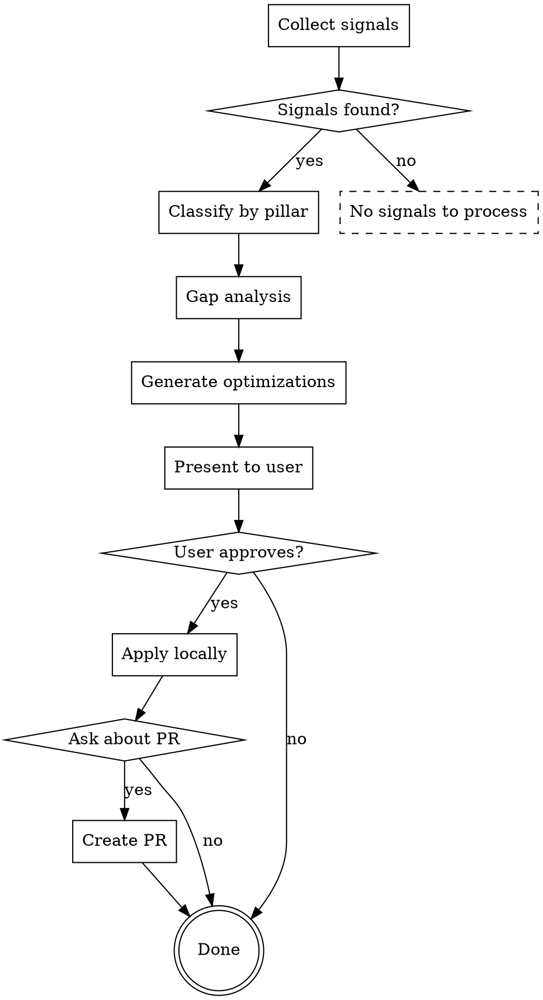

| Signal | Meaning | Action |
|--------|---------|--------|
| **Missing trigger** | Skill should have activated but didn't | Add trigger words to description |
| **Missing rule** | Skill activated but wrong behavior | Add specific rule/red flag |
| **Missing context** | Skill didn't account for project-specific pattern | Add project-aware section |
| **Rationalization loophole** | Agent found workaround for existing rule | Close loophole explicitly |
| **Stale content** | Skill references outdated patterns | Update with current patterns |
| **Token bloat** | Skill too large, slow to load | Compress, cross-reference, split |

**Analysis process:**
1. For each feedback signal, identify which skill (if any) should have handled it
2. If no skill covers this → **new skill needed** or **extend existing skill**
3. If a skill covers but failed → **gap in that skill's rules**
4. If a skill succeeded but user wanted different → **user preference to capture**

### Pillar 3: Optimization Engine (Act)

Apply optimizations based on gap analysis:

**Optimization types:**

```
Type 1: Trigger Refinement
  - Update description field with new trigger words
  - Add synonym coverage for common user phrasings

Type 2: Rule Addition
  - Add new rule based on user correction
  - Add red flag for the rationalization pattern observed

Type 3: Context Injection
  - Capture project-specific conventions
  - Add patterns observed in successful implementations

Type 4: Loophole Closure
  - When agent violated spirit of rule while following letter
  - Add explicit "No exceptions" section

Type 5: Compression
  - Remove redundant sections
  - Cross-reference other skills instead of repeating
  - Move heavy reference to separate files

Type 6: Split/Merge
  - Two skills covering same area → merge
  - One skill doing too many things → split
```

## The Optimization Workflow



## Step-by-Step Execution

### Step 1: Collect Signals

```bash
# Search recent conversations for skill-related feedback
# Look for user corrections, approvals, frustrations
grep -rn "不要\|应该\|stop\|perfect\|perfect\|keep doing\|怎么又\|还是没\|说了" \
  ~/.claude/logs/ 2>/dev/null || echo "No log directory found"

# Check git diff for recent skill changes
git diff HEAD~5 -- csp-meta/ csp-patterns/ 2>/dev/null | head -100
```

**Signal collection checklist:**
- [ ] Scan conversation for direct user corrections
- [ ] Scan conversation for user approvals ("这样对了")
- [ ] Check skill invocations that led to rejected output
- [ ] Check tool calls that failed after skill guidance
- [ ] Review git history for recent skill modifications
- [ ] Check memory files for feedback-type memories

### Step 2: Classify Signals

For each signal, classify:

```yaml
- signal: "这个 skill 没有处理 X 场景"
  type: missing_rule  # skill exists but lacks coverage
  target_skill: "csp-xxx"  # which skill should handle this
  severity: high  # high = user explicitly corrected, medium = implicit, low = suggestion
  evidence: "用户原话: '...'"

- signal: "用户说 'perfect, keep doing that'"
  type: user_preference  # capture what worked
  target_skill: "csp-xxx"
  severity: medium
  evidence: "用户原话: '...'"
```

### Step 3: Gap Analysis

For each classified signal:

1. **Identify target skill**: Which skill should handle this?
   - If no existing skill → new skill candidate
   - If multiple skills could → pick most specific, note overlap

2. **Determine gap type**: See gap types table above

3. **Draft fix**: Write the specific change needed
   - For missing trigger: new description text
   - For missing rule: new rule text with rationale
   - For loophole: explicit counter-example

### Step 4: Generate Optimizations

Produce a structured optimization plan:

```markdown
## Optimization Plan

### Skill: csp-xxx
**Gap**: Missing rule for X scenario
**Evidence**: 用户说 "..."
**Fix**: Add rule "..." to section Y
**Risk**: Low (additive change, no behavior removal)

### Skill: csp-yyy
**Gap**: Rationalization loophole in rule Z
**Evidence**: Agent did X despite rule Z because Y
**Fix**: Add "No exceptions: don't Y" under rule Z
**Risk**: Medium (may change behavior, needs testing)
```

### Step 5: Present & Approve

Present the full plan to the user:

> 根据最近的交互反馈，我发现了 N 个 skill 优化机会：
>
> 1. [高] csp-xxx: 添加 X 场景处理规则
> 2. [中] csp-yyy: 修复 Z 规则的绕过漏洞
> 3. [低] csp-zzz: 压缩 Token 占用
>
> 是否应用这些优化？

### Step 6: Apply Locally

If user approves:
1. Apply each optimization as a separate edit
2. Test the optimized skill against the original signal (verify it would now handle the case)
3. Commit changes: `git add -A && git commit -m "skill-optimizer: <summary>"`

### Step 7: PR Decision

After local application:

> 优化已应用到本地。是否提交 PR 回上游仓库？
>
> 这些优化基于你的实际使用反馈，对其他用户也有价值。
> 如果同意，我会:
> 1. 创建分支 `skill-optimizer/auto-improvements`
> 2. 提交 PR 到 code-skills-package
> 3. 附带用户反馈证据和优化说明

**If yes:** Create branch, commit, push, create PR
**If no:** Changes stay local, PR flow skipped

## Feedback Memory Integration

Skill Optimizer reads from and writes to the memory system:

**Reading:**
- Check `feedback` type memories for past user corrections
- Check `project` memories for project-specific conventions
- Apply remembered preferences during optimization

**Writing:**
- When user corrects behavior → save as `feedback` memory
- When user approves approach → save as `feedback` memory (success pattern)
- When project-specific pattern discovered → save as `project` memory

Memory format:
```markdown
---
name: skill-xxx-feedback-<topic>
description: User correction on csp-xxx skill behavior for <topic>
metadata:
  type: feedback
---

**Rule:** When csp-xxx encounters <condition>, do <action> instead of <old-behavior>.
**Why:** User corrected: "<user's exact words>"
**How to apply:** Add this rule to csp-xxx SKILL.md, section <Y>.
```

## Autonomy Mode

When run with "自动优化" intent (user says "automatically optimize"):

1. **Auto-collect**: Mine all available signals without prompting
2. **Auto-analyze**: Classify and prioritize gaps
3. **Auto-apply low-risk**: Apply Type 1 (trigger) and Type 5 (compression) without approval
4. **Prompt for medium-risk**: Present Type 2, 3, 4 changes for approval
5. **PR decision**: Always ask before creating PR

## Common Failure Modes

| Failure | Cause | Fix |
|---------|-------|-----|
| Optimization makes skill worse | Over-generalized from single data point | Require 2+ signals before changing behavior |
| Token bloat grows | Only adding, never compressing | Run Type 5 after every 3 Type 2 additions |
| Skills drift apart | Multiple skills covering same area | Run overlap check monthly |
| Project-specific leaks into generic | Capturing project conventions in generic skills | Use project CLAUDE.md for project-specific, skills for universal |

## Integration with Other Skills

- **writing-skills**: Skill Optimizer handles post-deployment evolution; writing-skills handles initial creation. Both use feedback-driven refinement.
- **skill-health**: Periodic health check of all skills; Skill Optimizer acts on individual skill signals.

## Quick Reference

| Phase | Activity | Output |
|-------|----------|--------|
| **Listen** | Collect feedback signals | Signal list with evidence |
| **Think** | Classify & analyze gaps | Gap analysis per signal |
| **Act** | Generate & apply fixes | Optimized skill files |
| **Share** | PR decision | PR or local-only |

## Real-World Impact

- **Feedback → Fix latency**: Minutes (immediate next session) vs weeks (manual skill updates)
- **Coverage growth**: Each user correction permanently improves skill coverage
- **Token efficiency**: Regular compression keeps skills loadable
- **Personalization**: Skills adapt to individual user patterns over time
