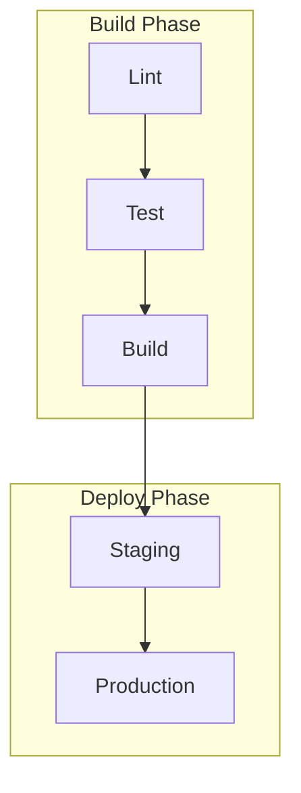

# GitHub Actions Workflow Specification

Guide for writing formal, AI-optimized specifications for GitHub Actions workflows.

## When to Use

- Documenting an existing workflow for maintenance and onboarding
- Designing a new workflow before implementation
- Auditing workflows for security, performance, or compliance gaps
- Creating reusable workflow templates for an organization

## Specification Principles

| Principle | Description |
|-----------|-------------|
| Token Efficiency | Concise language without sacrificing clarity |
| Structured Data | Tables, lists, and diagrams for dense information |
| Semantic Clarity | Precise terminology used consistently |
| Implementation Abstraction | Focus on *what*, not *how* -- avoid specific syntax or tool versions |
| Maintainability | Design for easy updates as the workflow evolves |

## Specification Structure

Save as: `/spec/spec-process-cicd-[workflow-name].md`

### Required Sections

1. **Workflow Overview** -- purpose, trigger events, target environments
2. **Execution Flow Diagram** -- Mermaid graph showing job dependencies
3. **Jobs and Dependencies** -- table of jobs with prerequisites and execution context
4. **Requirements Matrix** -- functional, security, and performance requirements with acceptance criteria
5. **Input/Output Contracts** -- environment variables, secrets, job outputs, artifacts
6. **Execution Constraints** -- timeouts, concurrency limits, runner requirements, permissions
7. **Error Handling Strategy** -- failure responses and recovery actions per error type
8. **Quality Gates** -- validation criteria, bypass conditions, approval requirements
9. **Monitoring and Observability** -- success rate targets, execution time, alerting rules
10. **Integration Points** -- external systems, dependent workflows, data exchange formats

### Optional Sections

- Compliance and governance (audit logs, approval gates, change control)
- Edge cases and exception scenarios
- Validation criteria and performance benchmarks
- Version history and change management process

## Workflow Overview Template

```yaml
title: CI/CD Workflow Specification - [Workflow Name]
version: 1.0
date_created: [YYYY-MM-DD]
last_updated: [YYYY-MM-DD]
owner: [Team or individual]
tags: [process, cicd, github-actions, automation]

purpose: [One sentence describing the workflow's primary goal]
trigger_events: [push, pull_request, schedule, workflow_dispatch, ...]
target_environments: [staging, production, ...]
```

## Jobs and Dependencies Table

| Job Name | Purpose | Dependencies | Execution Context |
|----------|---------|--------------|-------------------|
| lint | Code style validation | none | ubuntu-latest |
| test | Unit and integration tests | lint | ubuntu-latest |
| build | Compile and bundle | test | ubuntu-latest |
| deploy-staging | Deploy to staging | build | ubuntu-latest, staging env |
| deploy-prod | Deploy to production | deploy-staging, manual approval | ubuntu-latest, production env |

## Requirements Matrix

### Functional Requirements

| ID | Requirement | Priority | Acceptance Criteria |
|----|-------------|----------|---------------------|
| REQ-001 | All PRs run lint and test | High | Status checks appear on PR |
| REQ-002 | Main branch deploys to staging | High | Successful merge triggers deploy |
| REQ-003 | Production requires manual approval | High | Environment protection rules configured |

### Security Requirements

| ID | Requirement | Implementation Constraint |
|----|-------------|---------------------------|
| SEC-001 | No secrets in workflow files | Use GitHub Secrets or OIDC only |
| SEC-002 | Pin action versions | Use SHA or major version tags (`@v4`), never `@latest` |
| SEC-003 | Least-privilege permissions | Declare minimum required permissions at workflow/job level |

### Performance Requirements

| ID | Metric | Target | Measurement Method |
|----|--------|--------|-------------------|
| PERF-001 | CI completion time | < 10 minutes | Workflow run duration |
| PERF-002 | Cache hit rate | > 80% | Cache step logs |
| PERF-003 | Artifact storage | < 1 GB total | Repository storage metrics |

## Input/Output Contracts

### Inputs

```yaml
# Environment Variables
ENV_VAR_1: string   # Purpose: [description]
ENV_VAR_2: secret   # Purpose: [description]

# Repository Triggers
paths: [list of path filters]
branches: [list of branch patterns]
```

### Outputs

```yaml
# Job Outputs
artifact_name: string    # Build artifact identifier
build_output: file       # Compiled application bundle
coverage_report: file    # Test coverage results
```

### Secrets and Variables

| Type | Name | Purpose | Scope |
|------|------|---------|-------|
| Secret | `DEPLOY_TOKEN` | Cloud provider authentication | Environment |
| Secret | `NPM_TOKEN` | Private registry access | Repository |
| Variable | `NODE_VERSION` | Runtime version | Repository |

## Execution Constraints

- **Timeout**: Maximum 60 minutes per job (GitHub default), 6 hours per workflow
- **Concurrency**: Use concurrency groups to cancel redundant runs on the same branch
- **Resource Limits**: Choose appropriate runner sizes (`ubuntu-latest`, `ubuntu-latest-4-cores`)
- **Permissions**: Declare `permissions` block at workflow level, override at job level if needed

## Error Handling Strategy

| Error Type | Response | Recovery Action |
|------------|----------|-----------------|
| Build failure | Fail job, notify PR author | Fix code and push again |
| Test failure | Fail job, upload test reports | Debug with artifact logs |
| Deployment failure | Rollback to previous version | Manual intervention via environment |
| Timeout | Cancel job after threshold | Investigate and optimize slow steps |
| Flaky test | Retry once with `continue-on-error` | Quarantine and fix flaky tests separately |

## Quality Gates

| Gate | Criteria | Bypass Conditions |
|------|----------|-------------------|
| Code quality | Lint passes, no type errors | None -- always required |
| Security scan | No critical/high vulnerabilities | Documented false positives with approval |
| Test coverage | >= 80% line coverage | Legacy modules with documented exceptions |
| Build success | Artifact produced | None -- always required |

## Mermaid Diagram Guidelines

### Flow Types

```mermaid
%% Sequential
A --> B --> C

%% Parallel
A --> B
A --> C
B --> D
C --> D

%% Conditional
A --> B{Decision}
B -->|Yes| C
B -->|No| D
```

### Styling Conventions

```mermaid
style TriggerNode fill:#e1f5fe
style SuccessNode fill:#e8f5e8
style FailureNode fill:#ffebee
style ProcessNode fill:#f3e5f5
```

### Complex Workflows

For workflows with 5+ jobs, use subgraphs to group phases:



## Token Optimization

1. **Use tables** for dense information instead of prose paragraphs
2. **Abbreviate consistently** -- define once, reuse throughout
3. **Bullet points** over long sentences
4. **Code blocks** for structured data (YAML, JSON)
5. **Cross-reference** related specs instead of repeating content

## Analysis Checklist

When analyzing an existing workflow file:

1. Extract the core business purpose
2. Map the job dependency graph
3. Document all inputs, outputs, and interfaces
4. Capture timeouts, permissions, and resource limits
5. Identify validation and approval gate locations
6. Map failure scenarios and recovery paths
7. Abstract implementation details -- focus on behavior, not syntax

## Related

- [csp-cicd-pipelines SKILL.md](../SKILL.md) -- CI/CD pipeline patterns and examples
- [csp-infrastructure-as-code](../../csp-infrastructure-as-code/SKILL.md) -- Terraform and Pulumi provisioning
- [csp-deployment](../../csp-deployment/SKILL.md) -- deployment strategies and targets
