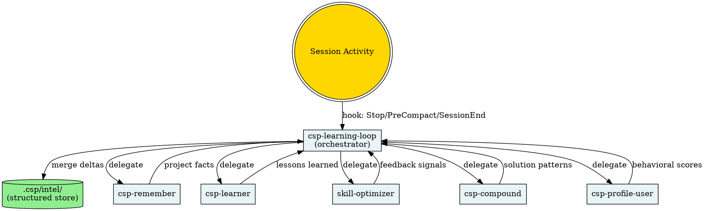

# CSP Learning Loop

Session-boundary learning orchestrator that transforms scattered session knowledge into a unified, queryable intelligence store (`.csp/intel/`) that accumulates across sessions.

## When to Use
- **Automatically** at session boundaries via hooks (Stop, PreCompact, SessionEnd)
- **Manually**: `/csp-learning-loop` to force a full extraction cycle
- **Query**: `/csp-learning-loop --query <dimension>` to read stored intel

## When NOT to Use
- Mid-session during active development (disruptive, saves partial state)
- When no meaningful session activity occurred
- For one-off questions that don't produce reusable knowledge

## The 5 Dimensions

| Dimension | File | Sources | Update Strategy |
|-----------|------|---------|----------------|
| **Project Core** | `project-core.md` | csp-compound, csp-remember | Merge architecture facts, stack info, conventions |
| **User Needs** | `user-needs.md` | Direct extraction | Track recurring tasks, preferred workflows, commands |
| **Developer Profile** | `developer-profile.md` | csp-profile-user | Incremental behavioral scores, style patterns |
| **Long-term Memory** | `long-term-memory.md` | csp-learner, csp-remember | Lessons learned, past decisions, durable facts |
| **Skill Feedback** | `skill-feedback.md` | skill-optimizer | Performance signals, coverage gaps |

## Architecture



## Execution Modes

### Mode: Delta (default, hook-triggered)

Lightweight incremental extraction at session boundaries.

1. Read `.csp/intel/_meta.json` for current state
2. Scan session transcript for extractable signals
3. For each signal, classify into one of 5 dimensions
4. Apply merge strategy (see references/merge-strategy.md):
   - Append new entries
   - Update existing entries with higher confidence if re-confirmed
   - Skip duplicates (content similarity > 0.85)
5. Write updated dimension files + changelog entry
6. Update `_meta.json` timestamps and counts

### Mode: Full (manual `/csp-learning-loop --full`)

Comprehensive extraction delegating to all source skills.

1. Run all 5 delegate skills in sequence
2. Aggregate outputs into dimension files
3. Run deduplication pass across all dimensions
4. Apply confidence decay to entries not re-confirmed
5. Archive entries below min_confidence (0.3)
6. Compress if any dimension exceeds 2000 tokens
7. Generate summary report

### Mode: Query (`/csp-learning-loop --query <dimension>`)

Read-only access for other skills or the user.

1. Read requested dimension file(s)
2. Format as context block
3. Return structured data with confidence scores

## Delegation Protocol

| Source Skill | What CLE Extracts | Target Dimension | Trigger |
|---|---|---|---|
| **csp-remember** | Items classified as "project memory" | project-core.md / long-term-memory.md | SessionEnd |
| **csp-learner** | Quality-gated extracted skills (passed all 3 gates) | long-term-memory.md | Stop |
| **skill-optimizer** | Classified feedback signals, gap analysis | skill-feedback.md | Stop |
| **csp-compound** | Solution patterns, vocabulary, architecture facts | project-core.md + long-term-memory.md | PostToolUse(Write to docs/solutions/) |
| **csp-profile-user** | Dimension scores, preference artifacts | developer-profile.md | SessionEnd |

## Merge Strategy

See `references/merge-strategy.md` for full specification.

**Core rules:**
- **Dedup**: Content similarity > 0.85 → merge into single entry, combine evidence
- **Confidence update**: `new_confidence = max(old, new)` for re-confirmed entries
- **Decay**: `confidence -= 0.02` per session where entry is not re-confirmed
- **Archive**: Entries below 0.3 confidence are moved to an archive section
- **Compress**: When dimension exceeds 2000 tokens, summarize lowest-confidence entries
- **Changelog**: Every write appends to `changelog.jsonl`

## Integration with Auto-Memory

- **Reads** `~/.claude/projects/.../memory/MEMORY.md` index at session start
- **Does NOT write** to auto-memory (avoids duplication)
- **Cross-references**: If auto-memory already has the same fact, skip writing to intel
- **Complementary**: Auto-memory stores individual facts; intel stores structured aggregates

## Profile Gating

Respects `CSP_HOOK_PROFILE` environment variable:

| Profile | Behavior |
|---------|----------|
| `minimal` | Learning loop disabled entirely |
| `standard` | Delta mode only at SessionEnd |
| `strict` | Delta at Stop + PreCompact + SessionEnd, full available manually |

Respects `CSP_DISABLED_HOOKS` — if `learning-loop` is listed, all hooks are skipped.

## Anti-Patterns

- **DO NOT** rewrite entire dimension files — always merge deltas
- **DO NOT** store Googleable knowledge — defer to docs/search
- **DO NOT** duplicate auto-memory entries — cross-reference instead
- **DO NOT** run full extraction mid-session — only at boundaries
- **DO NOT** exceed 2000 tokens per dimension file — compress when needed
- **DO NOT** store API keys, passwords, or credentials — filter aggressively
- **DO NOT** block on hook errors — always exit 0

## For Other Skills: Reading Intel

To incorporate accumulated intelligence into your work:

```bash
# Check if intel is available
ls .csp/intel/_meta.json 2>/dev/null && echo "Intel available"

# Read a specific dimension
cat .csp/intel/project-core.md

# Read metadata
cat .csp/intel/_meta.json | python3 -m json.tool
```

**Usage guidelines:**
- Before planning → read `project-core.md` for architecture decisions
- Before code review → read `developer-profile.md` for user preferences
- Before debugging → read `long-term-memory.md` for past solutions
- Before skill optimization → read `skill-feedback.md` for coverage gaps
- Before resuming work → read `_meta.json` for session context

## Related Skills

- [[csp-remember]] — Knowledge classification (delegate)
- [[csp-learner]] — Skill extraction (delegate)
- [[skill-optimizer]] — Feedback collection (delegate)
- [[csp-compound]] — Solution documentation (delegate)
- [[csp-profile-user]] — Behavioral profiling (delegate)
