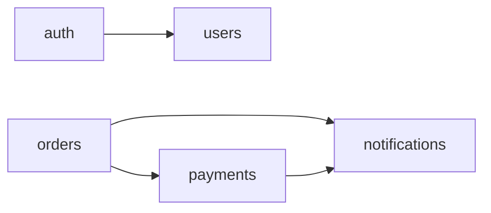

# CALL-RELATIONSHIPS

> 代码理解文档 · 调用关系

谁调用谁、被谁调用。识别 hub/bridge 函数、跨模块连接、孤立代码。

## 模块依赖图

## Hub 函数（被大量调用）

| 函数 | 模块 | 被调用次数 | 说明 |
|------|------|-----------|------|
| [name] | [module] | [N] | [为什么是 hub] |

## Bridge 函数（跨模块连接）

| 函数 | 连接模块 | 说明 |
|------|---------|------|
| [name] | [A ↔ B] | [跨模块连接点] |

## 调用关系矩阵

| 调用方 \ 被调用 | [模块A] | [模块B] | [模块C] |
|----------------|:------:|:------:|:------:|
| [模块A] | - | ✅ | ❌ |
| [模块B] | ❌ | - | ✅ |

## 未测试的关键路径

- [无 TESTED_BY 边的关键函数]（图谱可用时检测）

## 孤立代码（无调用方）

| 代码 | 路径 | 判定 |
|------|------|------|
| [name] | [path] | 疑似死代码/入口点 |

> 注：孤立不一定是死代码——可能是入口、事件处理器、定时任务。需结合上下文判断。
