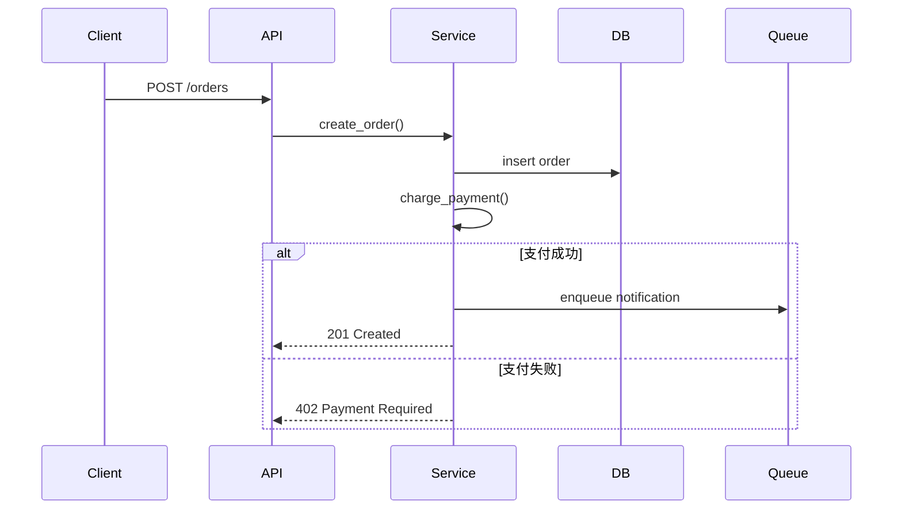

# KEY-PATHS

> 代码理解文档 · 关键执行路径

核心业务流程的调用链追踪。每条路径从入口到出口，标注决策点、异步边界、错误处理。

## [路径名: 如"用户下单"]



## 调用链

```
[入口] → [函数A] → [函数B] → [函数C] → [出口]
```

## 关键决策点

| 位置 | 决策 | 分支 |
|------|------|------|
| [函数:行] | [判断什么] | [成功/失败路径] |

## 异步边界

- [位置]: [异步操作]（[队列/定时任务/事件]）

## 错误处理路径

- [错误场景] → [处理函数] → [结果]

## 未测试段

- [路径中无测试覆盖的段]（图谱可用时从 TESTED_BY 边检测）
