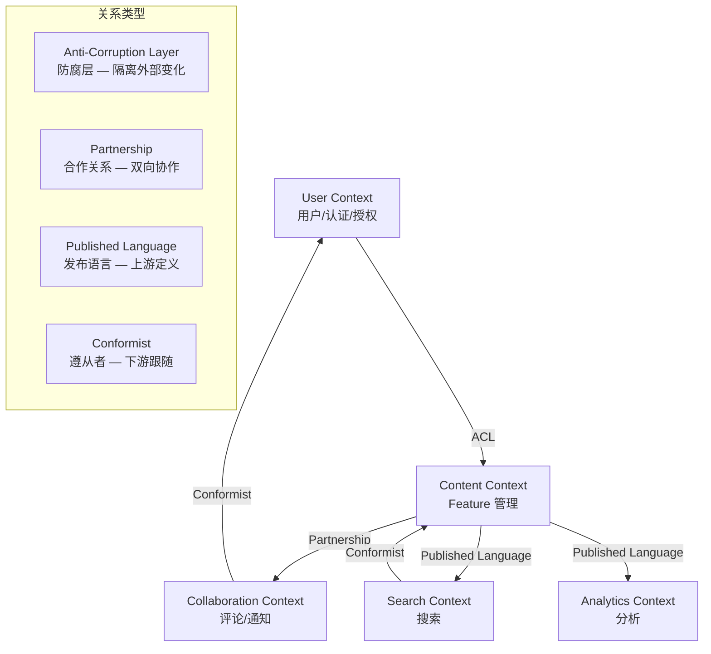

# Domain-Driven Design

对复杂业务系统进行 DDD 建模，将业务域映射为技术域的清晰架构。

## 核心理念

DDD 不是方法论，而是一套处理复杂业务域的模式和原则：
1. **聚焦核心域** — 把最好的设计和精力放在核心业务上
2. **通过协作探索模型** — 领域专家和开发人员共同构建模型
3. **在限界上下文中使用统一语言** — 每个上下文有自己的术语

## 何时使用 DDD

| 条件 | 适合 DDD | 不适合 DDD |
|------|---------|-----------|
| 业务复杂度 | 复杂业务规则、多状态流转 | 简单 CRUD |
| 团队规模 | 多人团队、需要对齐 | 个人项目 |
| 领域知识 | 需要深入理解业务 | 纯技术系统 |
| 跨团队协作 | 多个团队维护不同子系统 | 单人维护 |

## 输入

- `.csp/decomposition/` — Feature 拆解（域划分）
- PRD 文档 — 业务需求
- 与领域专家的讨论结果

## 执行流程

### Phase 1: 战略设计 — 限界上下文识别

从 Feature 拆解的域划分出发，识别限界上下文：

```markdown
## 限界上下文 (Bounded Contexts)

### 上下文识别方法

1. **语言边界分析** — 同一个词在不同上下文中的含义不同
2. **业务能力分析** — 按业务能力分组
3. **组织边界分析** — 按团队/部门划分
4. **数据所有权分析** — 按数据归属划分

### 上下文清单

| 上下文 | 核心职责 | 核心域/支撑域/通用域 | 输入语言 | 所属团队 |
|--------|---------|---------------------|---------|---------|
| 用户上下文 (User Context) | 用户注册、认证、授权、画像 | 支撑域 | 用户、角色、权限 | 平台团队 |
| 内容上下文 (Content Context) | Feature 创建、编辑、版本管理 | 核心域 | Feature、状态、优先级 | 业务团队 |
| 协作上下文 (Collaboration Context) | 评论、@提及、通知 | 支撑域 | 评论、通知、订阅 | 业务团队 |
| 搜索上下文 (Search Context) | 全文搜索、索引管理 | 通用域 | 索引、查询、排序 | 平台团队 |
| 分析上下文 (Analytics Context) | 数据统计、报表、趋势 | 支撑域 | 指标、报表、趋势 | 数据团队 |

### 上下文映射 (Context Map)



### 上下文关系详解

| 上游 | 下游 | 关系类型 | 集成方式 | 说明 |
|------|------|---------|---------|------|
| Content | Search | Published Language | 事件 (feature.*) | Content 发布事件，Search 消费 |
| Content | Analytics | Published Language | 事件 (feature.*) | Content 发布事件，Analytics 消费 |
| Content | Collab | Partnership | API + 事件 | 双向协作 |
| User | Content | ACL | API | Content 通过 ACL 隔离 User 变化 |
| User | Collab | Conformist | API | Collab 跟随 User 的模型 |
```

### Phase 2: 战术设计 — 聚合设计

对每个核心限界上下文，设计聚合：

```markdown
## 聚合设计 — Content Context

### 聚合根: Feature

```yaml
Aggregate: Feature
  Root: Feature
  Entities:
    - FeatureVersion (版本快照)
    - FeatureComment (评论)
  Value Objects:
    - FeatureId (UUID)
    - FeatureTitle (1-255 chars)
    - FeatureDescription (markdown text)
    - Priority (0-4, int)
    - Status (draft/active/archived/deleted)
    - AcceptanceCriteria (list of AC items)
    - TechDimensions (技术维度标记)
    - AuditInfo (created_by, created_at, updated_by, updated_at)

  Invariants (不变量):
    - Feature 标题不能为空
    - 优先级必须在 0-4 之间
    - 已归档的 Feature 不能编辑
    - 已删除的 Feature 不能归档
    - 状态转换必须遵循状态机

  Behaviors (行为):
    - create(title, description, priority): Feature
    - updateTitle(title): Feature
    - changePriority(priority): Feature
    - archive(): Feature
    - delete(): Feature (soft delete)
    - addComment(content): FeatureComment
    - createVersion(): FeatureVersion
    - restoreVersion(version): Feature

  State Machine:
    draft → active → archived → deleted
    draft → deleted
    active → draft (un-archive)
```

### 聚合边界

```
Feature Aggregate (聚合边界)
├── Feature (聚合根)
│   ├── FeatureVersion (子实体)
│   │   └── 通过 Feature 聚合根访问
│   └── FeatureComment (子实体)
│       └── 通过 Feature 聚合根访问
│
外部引用 (通过 ID，不持有对象引用):
├── UserId (评论作者)
├── DomainId (所属域)
└── TagId (标签)
```

### 聚合设计原则

1. **小聚合** — 聚合越小越好，只包含必须保持一致的实体
2. **通过 ID 引用** — 跨聚合引用使用 ID，不持有对象引用
3. **最终一致性** — 聚合间的一致性通过领域事件保证
4. **一个事务一个聚合** — 不在一个事务中修改多个聚合
```

### Phase 3: 领域事件设计

```markdown
## 领域事件

### 事件清单

| 事件 | 聚合 | 触发时机 | 消费者 |
|------|------|---------|--------|
| FeatureCreated | Feature | Feature.create() | Search, Analytics, Notification |
| FeatureTitleUpdated | Feature | Feature.updateTitle() | Search |
| FeaturePriorityChanged | Feature | Feature.changePriority() | Analytics |
| FeatureArchived | Feature | Feature.archive() | Search, Analytics |
| FeatureDeleted | Feature | Feature.delete() | Search, Analytics |
| CommentAdded | Feature | Feature.addComment() | Notification |
| VersionCreated | Feature | Feature.createVersion() | Analytics |

### 事件结构

```yaml
event: FeatureCreated
  event_id: "evt_abc123"
  aggregate_id: "feat_xyz789"
  aggregate_type: "Feature"
  event_type: "FeatureCreated"
  occurred_at: "2026-08-13T10:00:00Z"
  version: 1
  payload:
    feature_id: "feat_xyz789"
    title: "My Feature"
    priority: 2
    status: "draft"
    created_by: "user_abc"
    created_at: "2026-08-13T10:00:00Z"
  metadata:
    source: "content-context"
    causation_id: "cmd_create_feature"
    correlation_id: "req_123"
```

### 事件处理策略

| 事件 | 处理方式 | 一致性 | 幂等键 |
|------|---------|--------|--------|
| FeatureCreated | 异步 | 最终一致 | event_id |
| FeatureTitleUpdated | 异步 | 最终一致 | event_id |
| FeatureArchived | 异步 | 最终一致 | event_id |
```

### Phase 4: 仓储模式

```markdown
## 仓储 (Repository)

### 仓储接口

```python
# content/domain/repository.py

class FeatureRepository(ABC):
    """Feature 聚合的仓储接口"""
    
    @abstractmethod
    async def find_by_id(self, feature_id: FeatureId) -> Optional[Feature]:
        """通过 ID 查找 Feature 聚合"""
        pass
    
    @abstractmethod
    async def find_by_status(self, status: Status, page: Page) -> List[Feature]:
        """按状态分页查找"""
        pass
    
    @abstractmethod
    async def save(self, feature: Feature) -> None:
        """保存 Feature 聚合 (新增/更新)"""
        pass
    
    @abstractmethod
    async def delete(self, feature_id: FeatureId) -> None:
        """删除 Feature (软删除)"""
        pass
```

### 仓储实现

```python
# content/infrastructure/repository.py

class PostgresFeatureRepository(FeatureRepository):
    """PostgreSQL 实现的 Feature 仓储"""
    
    def __init__(self, session: AsyncSession, event_bus: EventBus):
        self.session = session
        self.event_bus = event_bus
    
    async def save(self, feature: Feature) -> None:
        # 1. 持久化聚合
        await self.session.merge(feature.to_orm())
        
        # 2. 发布领域事件
        for event in feature.domain_events:
            await self.event_bus.publish(event)
        
        # 3. 清除事件
        feature.clear_events()
```

### 仓储原则
1. 一个聚合一个仓储
2. 仓储只处理聚合根
3. 仓储接口在领域层，实现在基础设施层
4. 仓储负责发布领域事件
```

### Phase 5: 应用服务与领域服务

```markdown
## 应用服务 vs 领域服务

### 应用服务 (Application Service)
- 编排领域对象完成用例
- 不包含业务逻辑
- 管理事务边界

```python
# content/application/service.py

class FeatureApplicationService:
    def __init__(self, repo: FeatureRepository, user_service: UserService):
        self.repo = repo
        self.user_service = user_service
    
    async def create_feature(self, cmd: CreateFeatureCommand) -> FeatureId:
        # 1. 验证用户
        user = await self.user_service.get_user(cmd.user_id)
        
        # 2. 创建聚合
        feature = Feature.create(
            title=cmd.title,
            description=cmd.description,
            priority=cmd.priority,
            created_by=user.id
        )
        
        # 3. 持久化
        await self.repo.save(feature)
        
        return feature.id
```

### 领域服务 (Domain Service)
- 包含不属于任何聚合的业务逻辑
- 无状态
- 操作多个聚合

```python
# content/domain/service.py

class FeaturePriorityService:
    """跨 Feature 的优先级调整领域服务"""
    
    async def rebalance_priorities(
        self, 
        features: List[Feature], 
        repo: FeatureRepository
    ) -> None:
        """当删除一个 Feature 后，重新平衡其他 Feature 的优先级"""
        for i, feature in enumerate(sorted(features, key=lambda f: f.priority)):
            feature.change_priority(min(i, 4))
        for feature in features:
            await repo.save(feature)
```

### 分层架构

```
┌─────────────────────────────────────────────┐
│  Interface Layer (API/UI)                     │
│  - Router / Controller / GraphQL Resolver     │
├─────────────────────────────────────────────┤
│  Application Layer (用例编排)                  │
│  - Application Service / Command Handler      │
│  - DTO / Command / Query                      │
│  - 事务管理                                    │
├─────────────────────────────────────────────┤
│  Domain Layer (核心业务逻辑)                    │
│  - Aggregate / Entity / Value Object          │
│  - Domain Service / Domain Event              │
│  - Repository Interface                       │
│  - 不依赖任何外部框架                            │
├─────────────────────────────────────────────┤
│  Infrastructure Layer (技术实现)               │
│  - Repository Implementation                  │
│  - Event Bus / Message Queue                  │
│  - External Service Client                    │
│  - ORM / Database                             │
└─────────────────────────────────────────────┘
```

### Phase 6: 输出产物

```
.csp/ddd/
├── BOUNDED-CONTEXTS.md          # 限界上下文清单
├── CONTEXT-MAP.md               # 上下文映射
├── AGGREGATES/                   # 聚合设计
│   ├── AGGREGATE-Feature.yaml
│   ├── AGGREGATE-User.yaml
│   └── ...
├── DOMAIN-EVENTS.md             # 领域事件清单
├── REPOSITORIES.md              # 仓储设计
├── SERVICES.md                  # 领域服务/应用服务
├── UBIQUITOUS-LANGUAGE.md       # 统一语言词汇表
└── DDD-SUMMARY.md               # DDD 建模摘要
```

## 统一语言词汇表

```markdown
## Ubiquitous Language — Content Context

| 术语 | 英文 | 定义 | 约束 |
|------|------|------|------|
| Feature | Feature | 产品功能需求项 | 有唯一 ID、标题、状态 |
| 状态 | Status | Feature 的生命周期阶段 | draft/active/archived/deleted |
| 优先级 | Priority | Feature 的重要程度 | 0-4，0=最低，4=最高 |
| 验收标准 | Acceptance Criteria | Feature 完成的验证条件 | 至少 1 条，每条可测试 |
| 版本 | Version | Feature 在某时刻的内容快照 | 只读，不可修改 |
| 归档 | Archive | 将 Feature 标记为历史状态 | 不可逆 (除非取消归档) |
```

## 完成信号

```yaml
completion_signal:
  output: .csp/ddd/DDD-SUMMARY.md
  next_step:
    recommended: csp-tech-solution-design
    alternatives: [csp-fullstack-spec-generator]
  status:
    ddd_path: .csp/ddd/
    bounded_contexts: "{{count}}"
    aggregates: "{{count}}"
    domain_events: "{{count}}"
    phase: plan
    ready_for: [tech-solution-design, spec-generation]
```

## 关键原则

1. **不是所有系统都需要 DDD** — 简单 CRUD 不需要，复杂业务逻辑才需要
2. **聚焦核心域** — 80% 的建模精力放在核心域，支撑域和通用域可以简化
3. **小聚合** — 聚合越小越好，只包含必须保持一致的实体
4. **通过 ID 引用** — 跨聚合引用使用 ID，降低耦合
5. **领域事件驱动集成** — 聚合间通过事件通信，保证最终一致性
6. **统一语言是核心** — 代码中的术语与业务讨论中的术语一致