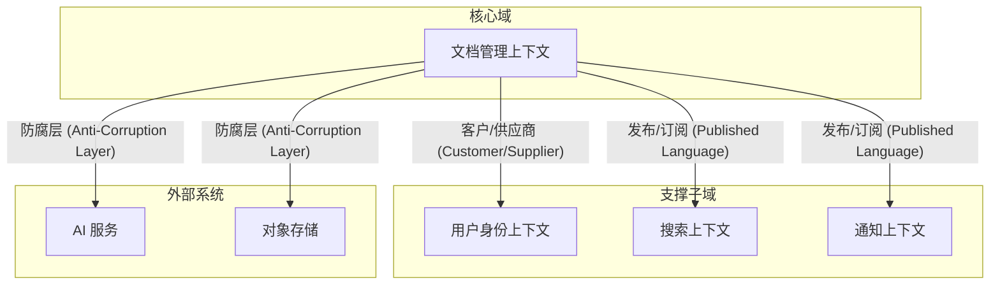

# Domain-Driven Design

领域驱动设计建模引擎 — 把复杂业务领域映射为清晰的软件模型。

## 核心理念

DDD 不是一套技术，而是一种思维方式。它的核心是**把业务专家的心智模型翻译成代码模型**，让代码结构反映业务结构。

与 `csp-requirement-decomposition` 的域划分协同：
- `csp-requirement-decomposition` 按业务能力划分域（Domain A: 用户管理, Domain B: 文档管理...）
- `csp-domain-driven-design` 将这些域进一步建模为限界上下文、聚合、实体、值对象

## 输入

- `.csp/decomposition/DECOMPOSITION-SUMMARY.md` — Feature 清单 + 域划分
- `.csp/decomposition/FEATURE-DETAILS/*.yaml` — 每个 Feature 的业务规则
- 领域专家访谈结果（如有）

## DDD 核心概念

### 战略设计 (Strategic Design)

#### 1. 限界上下文 (Bounded Context)

限界上下文是 DDD 的核心概念。每个限界上下文内，术语有明确的含义，模型有清晰的边界。

```yaml
bounded_contexts:
  - name: "用户身份上下文 (User Identity Context)"
    description: "管理用户注册、登录、认证、权限"
    core_domain: false                    # 支撑子域
    ubiquitous_language:
      User: "注册用户，拥有唯一 email"
      Role: "用户角色，如 admin/editor/viewer"
      Permission: "权限，如 create_document/delete_document"
    entities:
      - User
      - Role
    services:
      - AuthenticationService
      - AuthorizationService
    events:
      - UserRegistered
      - UserRoleChanged

  - name: "文档管理上下文 (Document Management Context)"
    description: "文档的创建、编辑、版本管理、协作"
    core_domain: true                     # 核心域
    ubiquitous_language:
      Document: "用户创建的文档，包含标题、内容、版本"
      Version: "文档的某个版本快照"
      Collaboration: "多用户同时编辑文档的会话"
    entities:
      - Document
      - Version
    aggregates:
      - Document (根: Document, 实体: Version, Comment)
    services:
      - DocumentService
      - VersionService
      - CollaborationService
    events:
      - DocumentCreated
      - DocumentUpdated
      - DocumentVersionCreated
      - CollaborationStarted
      - CollaborationEnded

  - name: "搜索上下文 (Search Context)"
    description: "文档全文搜索和语义搜索"
    core_domain: false
    ubiquitous_language:
      SearchQuery: "用户的搜索请求"
      SearchResult: "搜索结果，包含文档摘要和相关性分数"
      Index: "搜索索引"
    entities:
      - SearchIndex
    services:
      - SearchService
      - IndexService
    events:
      - DocumentIndexed
      - IndexUpdated

  - name: "通知上下文 (Notification Context)"
    description: "消息推送、邮件、站内通知"
    core_domain: false
    ubiquitous_language:
      Notification: "发送给用户的通知消息"
      Channel: "通知渠道，如 email/push/in-app"
      Template: "通知模板"
    entities:
      - Notification
      - Template
    services:
      - NotificationService
      - TemplateService
    events:
      - NotificationSent
      - NotificationRead
```

#### 2. 上下文映射 (Context Map)

限界上下文之间的关系：



上下文关系类型：

| 关系类型 | 描述 | 适用场景 |
|---------|------|---------|
| 共享内核 (Shared Kernel) | 两个上下文共享部分模型 | 紧密协作的团队 |
| 客户/供应商 (Customer/Supplier) | 上游提供，下游消费 | 上下游关系明确 |
| 跟随者 (Conformist) | 下游完全跟随上游模型 | 上游不可控 |
| 防腐层 (ACL) | 下游翻译上游模型 | 集成遗留系统/外部系统 |
| 开放主机服务 (OHS) | 上游提供标准化 API | 多下游消费者 |
| 发布语言 (Published Language) | 通过标准格式(事件/API)通信 | 松耦合集成 |
| 各行其道 (Separate Ways) | 不集成 | 无协作需求 |

### 战术设计 (Tactical Design)

#### 3. 实体 (Entity)

有唯一标识、有生命周期的对象：

```yaml
entity:
  Document:
    identity: "DocumentId (UUID)"        # 唯一标识
    attributes:
      - title: "string (1-255)"
      - content: "string (markdown)"
      - status: "enum: draft/published/archived"
      - version: "int (乐观锁)"
      - created_at: "datetime"
      - updated_at: "datetime"
    behavior:
      - publish(): "将 status 从 draft 改为 published"
      - archive(): "将 status 改为 archived"
      - updateContent(content): "更新内容，version++"
    invariants:                           # 不变量
      - "已归档的文档不能编辑"
      - "title 不能为空"
      - "version 只能递增"
```

#### 4. 值对象 (Value Object)

无唯一标识、不可变、通过属性值判断相等：

```yaml
value_object:
  DocumentTitle:
    value: "string"
    constraints:
      - "1-255 字符"
      - "不能为空"
      - "不能只包含空白字符"
    behavior:
      - slug(): "生成 URL 友好的 slug"
  
  DocumentStatus:
    value: "enum: draft | published | archived"
    transitions:
      - "draft → published"
      - "published → archived"
      - "draft → archived"
      - "禁止: archived → draft"
  
  SearchQuery:
    attributes:
      - keywords: "string"
      - filters: "map<string, any>"
      - page: "int (≥1)"
      - page_size: "int (1-100)"
    behavior:
      - validate(): "校验查询参数合法性"
```

#### 5. 聚合 (Aggregate)

一组相关对象的集合，有一个聚合根 (Aggregate Root) 作为入口：

```yaml
aggregate:
  DocumentAggregate:
    root: "Document (聚合根)"
    entities:
      - "Version (通过 Document 访问)"
      - "Comment (通过 Document 访问)"
    value_objects:
      - "DocumentTitle"
      - "DocumentStatus"
    invariants:
      - "一个 Document 最多保留 100 个 Version"
      - "只有 published 状态的 Document 可以有 Comment"
      - "删除 Document 时级联删除所有 Version 和 Comment"
    rules:
      - "外部只能通过 Document 引用 Version 和 Comment"
      - "Comment 不能独立于 Document 存在"
      - "事务边界 = 单个聚合"

  UserAggregate:
    root: "User"
    entities:
      - "UserProfile (1:1)"
    value_objects:
      - "Email"
      - "PasswordHash"
    invariants:
      - "Email 全局唯一"
      - "密码至少 8 位"
```

#### 6. 领域事件 (Domain Event)

领域中发生的重要事情：

```yaml
domain_events:
  DocumentCreated:
    aggregate: "DocumentAggregate"
    payload:
      document_id: "UUID"
      title: "string"
      author_id: "UUID"
      created_at: "datetime"
    consumers:
      - "搜索上下文: 索引新文档"
      - "通知上下文: 通知关注者"
  
  DocumentPublished:
    aggregate: "DocumentAggregate"
    payload:
      document_id: "UUID"
      published_at: "datetime"
    consumers:
      - "搜索上下文: 更新索引状态"
      - "通知上下文: 通知订阅者"
  
  CollaborationStarted:
    aggregate: "DocumentAggregate"
    payload:
      document_id: "UUID"
      session_id: "UUID"
      participants: ["UUID"]
    consumers:
      - "通知上下文: 通知被邀请者"
  
  UserRegistered:
    aggregate: "UserAggregate"
    payload:
      user_id: "UUID"
      email: "string"
      registered_at: "datetime"
    consumers:
      - "通知上下文: 发送欢迎邮件"
```

#### 7. 领域服务 (Domain Service)

不属于任何实体或值对象的领域逻辑：

```yaml
domain_services:
  CollaborationMergeService:
    description: "合并多个用户的协作编辑结果"
    input: "原始文档 + 多个编辑操作"
    output: "合并后的文档"
    rules:
      - "基于 OT 算法合并"
      - "冲突时使用 last-write-wins + 标记冲突"
      - "合并不改变文档 version"
  
  DocumentPermissionService:
    description: "检查用户对文档的权限"
    input: "User + Document + Action"
    output: "boolean"
    rules:
      - "owner 拥有所有权限"
      - "editor 可读写"
      - "viewer 只读"
      - "archived 文档所有人只读"
```

#### 8. 仓储 (Repository)

聚合的持久化接口：

```yaml
repositories:
  DocumentRepository:
    interface:
      - save(Document): void
      - findById(DocumentId): Document?
      - findByAuthor(UserId, Page): Page<Document>
      - findByStatus(DocumentStatus, Page): Page<Document>
      - search(SearchQuery): Page<Document>
      - delete(DocumentId): void
    implementation: "PostgresDocumentRepository"
  
  UserRepository:
    interface:
      - save(User): void
      - findById(UserId): User?
      - findByEmail(Email): User?
    implementation: "PostgresUserRepository"
```

## 输出产物

```
.csp/tech-design/
├── DDD-MODEL.md               # DDD 建模文档
│   ├── Bounded Contexts
│   ├── Context Map
│   ├── Aggregates
│   ├── Entities
│   ├── Value Objects
│   ├── Domain Events
│   └── Domain Services
├── UBIQUITOUS-LANGUAGE.md     # 统一语言词汇表
└── DDD-CONTEXT-MAP.md         # 上下文映射图
```

## 统一语言词汇表

```markdown
# Ubiquitous Language

## 文档管理上下文

| 术语 | 定义 | 备注 |
|------|------|------|
| Document | 用户创建的文档，包含标题、内容、版本 | 核心实体 |
| Version | 文档的某个版本快照 | 不可变 |
| Draft | 草稿状态，仅作者可见 | 可编辑 |
| Published | 已发布状态，所有人可见 | 不可直接编辑 |
| Archived | 已归档状态，只读 | 不可编辑 |
| Collaboration | 多用户同时编辑文档的会话 | 实时 |
| Merge | 合并多个用户的编辑操作 | 冲突时标记 |
| Publish | 将文档从 Draft 变为 Published | 单向操作 |
| Archive | 将文档从 Published 变为 Archived | 单向操作 |

## 用户身份上下文

| 术语 | 定义 | 备注 |
|------|------|------|
| User | 注册用户 | 唯一 email |
| Role | 用户角色 | admin/editor/viewer |
| Permission | 操作权限 | CRUD 细粒度 |
| Authentication | 身份验证 | JWT 双 token |
| Authorization | 权限校验 | RBAC |
```

## 门控检查

- [ ] 限界上下文已识别，边界清晰
- [ ] 每个限界上下文有统一语言词汇表
- [ ] 上下文映射图完整（所有上下文关系）
- [ ] 聚合根已识别，聚合边界合理
- [ ] 每个聚合有不变量定义
- [ ] 领域事件已识别，消费者明确
- [ ] 与 requirement-decomposition 的域划分一致

## 完成信号

```yaml
completion_signal:
  output: .csp/tech-design/DDD-MODEL.md
  next_step:
    recommended: csp-tech-solution-design
    alternatives: [csp-fullstack-spec-generator]
  status:
    ddd_model_path: .csp/tech-design/
    bounded_contexts: "{{count}}"
    aggregates: "{{count}}"
    domain_events: "{{count}}"
    phase: define
    ready_for: [tech-solution-design, spec-generation]
```

## 与其他 Skill 的协作

| 上游 Skill | 提供什么 |
|-----------|---------|
| csp-requirement-decomposition | 域划分 + Feature 业务规则 |

| 下游 Skill | 消费什么 |
|-----------|---------|
| csp-tech-solution-design | 限界上下文 + 聚合 → 模块划分 |
| csp-fullstack-spec-generator | 聚合 + 实体 + 值对象 → 数据库 Schema |

## 快速开始示例

```
输入: 知识库系统，4 个业务域

DDD 建模:
  限界上下文:
    1. 用户身份上下文 (支撑子域)
       - 聚合: User
       - 实体: User, UserProfile, Role
       - 值对象: Email, PasswordHash
       - 事件: UserRegistered, UserRoleChanged

    2. 文档管理上下文 (核心域)
       - 聚合: Document (根), Version, Comment
       - 实体: Document, Version, Comment
       - 值对象: DocumentTitle, DocumentStatus
       - 事件: DocumentCreated, DocumentPublished, CollaborationStarted
       - 领域服务: CollaborationMergeService, DocumentPermissionService

    3. 搜索上下文 (支撑子域)
       - 实体: SearchIndex
       - 值对象: SearchQuery, SearchResult
       - 事件: DocumentIndexed

    4. 通知上下文 (支撑子域)
       - 聚合: Notification
       - 实体: Notification, Template
       - 值对象: Channel, NotificationStatus
       - 事件: NotificationSent

  上下文映射:
    - 文档 → 用户: 客户/供应商
    - 文档 → 搜索: 发布语言 (事件)
    - 文档 → 通知: 发布语言 (事件)
    - 文档 → AI 服务: 防腐层
```