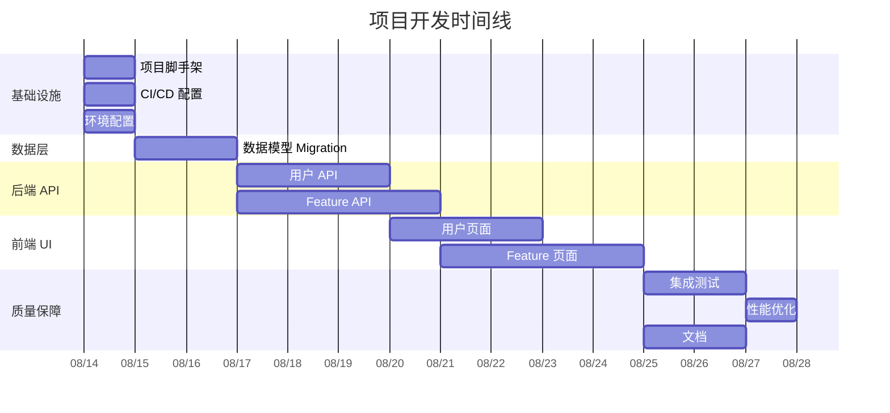

# Effort Estimation

从技术方案和任务拆解推算工作量、资源需求和时间线。

## 核心理念

估算不是算命，而是基于可用的最佳信息做出合理的预测：
1. **分解是估算的基础** — 任务拆解得越细，估算越准确
2. **不确定性需要量化** — 用范围代替单点值，用置信区间代替确定性
3. **多种方法交叉验证** — 单一方法的结果不可靠，多方法交叉验证提高可信度
4. **估算需要持续校准** — 随着项目推进，用实际数据更新估算

## 输入

- `.csp/tasks/` — 任务拆解产物（WBS、TASK-CARDS、DEPENDENCY-DAG）
- `.csp/tech-design/` — 技术方案设计（评估复杂度）
- 团队信息（人数、技能、经验）
- 历史数据（如有类似项目的实际工时数据）

## 估算方法

### 方法 1: 类比估算 (Analogy-Based)

基于类似项目/任务的历史数据进行估算：

```markdown
## 类比估算

### 参照项目
| 参照任务 | 实际工时 | 相似度 | 当前任务 | 估算工时 |
|---------|---------|--------|---------|---------|
| 用户 CRUD API (上次项目) | 8h | 90% | 用户 CRUD API (本次) | 7.2h |
| Feature 列表页 (上次项目) | 12h | 80% | Feature 列表页 (本次) | 9.6h |

### 调整因子
- 技术栈变化: +10% (新框架)
- 团队变化: -5% (团队成员更熟悉)
- 复杂度变化: +20% (多了权限控制)

### 总估算: 任务数 × 平均工时 × 调整因子
```

### 方法 2: 三点估算 (PERT)

对每个任务估算三个值：

```markdown
## 三点估算 (PERT)

公式: E = (O + 4M + P) / 6
标准差: σ = (P - O) / 6

| WBS | 任务 | O (乐观) | M (最可能) | P (悲观) | E (期望) | σ (标准差) |
|-----|------|---------|-----------|---------|---------|-----------|
| 1.1 | 项目脚手架 | 1h | 2h | 4h | 2.2h | 0.5h |
| 2.1.1 | users 表 Migration | 0.3h | 0.5h | 1.5h | 0.6h | 0.2h |
| 3.1.3 | 用户 Service | 2h | 3h | 8h | 3.7h | 1.0h |
| 3.1.5 | 用户 API 测试 | 1h | 2h | 5h | 2.3h | 0.7h |
| 4.2.1 | Feature 列表页 | 2h | 4h | 10h | 4.7h | 1.3h |

### 汇总统计
| 指标 | 值 |
|------|-----|
| 总期望工时 | ΣE = 152h |
| 总标准差 | √Σ(σ²) = 12h |
| 68% 置信区间 | 140h - 164h |
| 95% 置信区间 | 128h - 176h |
```

### 方法 3: COCOMO II (适用于大型项目)

```markdown
## COCOMO II 估算

### 规模估算
- 预估代码行数 (KSLOC): 15K
- 规模因子 (Scale Factors):
  - 先例性 (PREC): 3.72 (有一些经验)
  - 开发灵活性 (FLEX): 3.04 (中等灵活)
  - 架构/风险解决 (RESL): 4.24 (基本)
  - 团队凝聚力 (TEAM): 3.29 (基本)
  - 过程成熟度 (PMAT): 3.12 (基本)

### 指数计算
E = 0.91 + 0.01 × ΣSF = 0.91 + 0.01 × 17.41 = 1.084

### 工作量估算
PM = A × (KSLOC)^E × Π(EM)
= 2.94 × 15^1.084 × 0.88
= 2.94 × 17.2 × 0.88
= 44.5 人月

### 工期估算
TDEV = 3.67 × PM^(0.28+0.002×ΣSF)
= 3.67 × 44.5^0.318
= 12.3 个月

### 团队规模
N = PM / TDEV = 44.5 / 12.3 ≈ 3.6 人
```

### 方法 4: 综合估算 (推荐)

结合多种方法，加权平均：

```markdown
## 综合估算

| 方法 | 估算结果 | 权重 | 加权 |
|------|---------|------|------|
| 类比估算 | 135h | 0.3 | 40.5 |
| 三点估算 (PERT) | 152h | 0.5 | 76.0 |
| COCOMO II | 148h | 0.2 | 29.6 |
| **综合估算** | | | **146.1h** |

推荐使用 PERT 期望值作为基准，类比和 COCOMO 作为验证。
```

## 执行流程

### Phase 1: 任务复杂度评估

对每个任务评估复杂度：

```markdown
## 复杂度评估

| WBS | 任务 | 复杂度 | 不确定度 | 技术风险 | 综合因子 |
|-----|------|--------|---------|---------|---------|
| 1.1 | 项目脚手架 | 低 | 低 | 低 | 1.0x |
| 2.1.1 | users 表 Migration | 低 | 低 | 低 | 1.0x |
| 3.1.3 | 用户 Service | 中 | 中 | 低 | 1.2x |
| 4.2.1 | Feature 列表页 | 中 | 高 | 中 | 1.5x |
| 5.2 | 性能优化 | 高 | 高 | 高 | 2.0x |

### 因子说明
- 复杂度: 低=标准CRUD, 中=多规则业务, 高=算法/分布式
- 不确定度: 低=需求明确, 中=需少量澄清, 高=需大量探索
- 技术风险: 低=成熟技术, 中=需要学习, 高=首次使用
```

### Phase 2: 资源需求分析

```markdown
## 资源需求

### 人力资源
| 角色 | 人数 | 占用率 | 投入时间 | 关键技能 |
|------|------|--------|---------|---------|
| 后端开发 | 2 | 100% | 全程 | Python/FastAPI/PostgreSQL |
| 前端开发 | 1 | 80% | Wave 4-5 | React/Next.js |
| 全栈开发 | 1 | 100% | 全程 | 全栈 |
| QA | 1 | 50% | Wave 5 | 测试 |

### 环境资源
| 资源 | 规格 | 用途 | 费用(月) |
|------|------|------|---------|
| 开发服务器 | 4C8G | 开发环境 | ¥0 (本地) |
| 测试环境 K8s | 3 节点 | 集成测试 | ¥500 |
| 数据库 | 2C4G 50GB | 测试 DB | ¥200 |

### 工具和许可证
| 工具 | 用途 | 费用(月) |
|------|------|---------|
| GitHub Team | 代码托管 | ¥28/人 |
| Sentry | 错误监控 | 免费额度 |
```

### Phase 3: 时间线生成

```markdown
## 时间线与甘特图

### 甘特图 (Mermaid)



### 里程碑
| 里程碑 | 日期 | 交付物 | 验收标准 |
|--------|------|--------|---------|
| M1: 基础设施就绪 | 08/15 | 开发环境 + CI/CD | 提交代码可自动构建 |
| M2: 数据层完成 | 08/17 | 所有表 Migration | Migration 可运行 |
| M3: 后端 API 完成 | 08/21 | 所有 API 端点 | 集成测试通过 |
| M4: 前端 UI 完成 | 08/26 | 所有页面 | E2E 测试通过 |
| M5: 发布就绪 | 08/29 | 完整系统 | 所有测试通过 + 文档 |
```

### Phase 4: 风险缓冲

```markdown
## 风险缓冲

### 缓冲策略
- 项目缓冲: 总工时的 20% (用于项目级风险)
- 汇入缓冲: 每个 Wave 的 15% (用于 Wave 级风险)
- 资源缓冲: 每个关键角色的 10% 冗余 (用于人员变动)

### 缓冲分配
| 位置 | 类型 | 时间 | 用途 |
|------|------|------|------|
| 总工期 | 项目缓冲 | +3d | 未知风险、范围蔓延 |
| Wave 3 | 汇入缓冲 | +0.5d | 后端 API 风险 |
| Wave 4 | 汇入缓冲 | +0.5d | 前端 UI 风险 |
| 后端 | 资源缓冲 | 备用 1 人 | 后端人员请假 |
```

### Phase 5: 输出产物

```
.csp/estimation/
├── EFFORT-ESTIMATION.md        # 工作量估算报告
├── COMPLEXITY-ASSESSMENT.md    # 复杂度评估
├── RESOURCE-PLAN.md            # 资源计划
├── TIMELINE.md                 # 时间线 + 甘特图
├── RISK-BUFFER.md              # 风险缓冲分配
└── ESTIMATION-SUMMARY.md       # 估算摘要
```

## 估算精度

| 阶段 | 精度范围 | 适用方法 |
|------|---------|---------|
| 需求阶段 | ±50% | 类比估算 |
| 方案设计阶段 | ±30% | 三点估算 (PERT) |
| 任务拆解后 | ±20% | 自底向上 |
| 开发中 | ±10% | 实际工时跟踪 |

## 完成信号

```yaml
completion_signal:
  output: .csp/estimation/ESTIMATION-SUMMARY.md
  next_step:
    recommended: csp-lifecycle-orchestrator
    alternatives: [csp-implementation-phase]
  status:
    estimation_path: .csp/estimation/
    total_effort: "{{hours}}h"
    confidence_interval: "{{low}}h - {{high}}h"
    estimated_completion: "{{date}}"
    team_size: "{{count}}"
    phase: plan
    ready_for: [implementation-planning, sprint-planning]
```

## 关键原则

1. **用范围代替单点** — 永远不给出"X 天"这样的单点估算
2. **多方法交叉验证** — 至少用 2 种方法，结果越接近越可信
3. **不确定性要量化** — 用标准差和置信区间，而不是"可能"
4. **缓冲要透明** — 标注缓冲的位置和用途，不是偷偷加 50%
5. **持续校准** — 每个里程碑结束后用实际数据重新估算
6. **不压榨估算** — 估算不是谈判，是工程判断