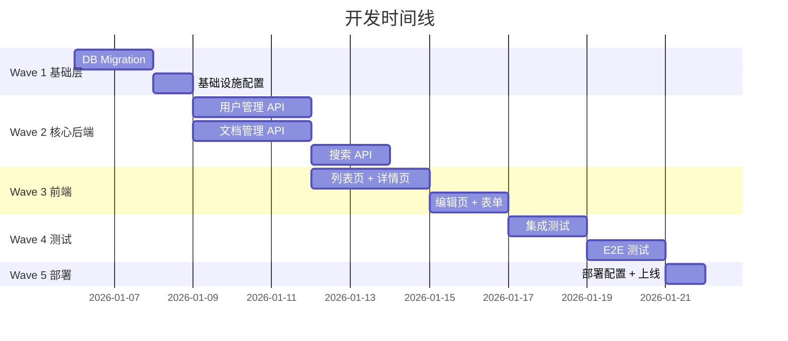

# Effort Estimation

工作量与资源估算引擎 — 从任务拆解出发，推算工作量、资源需求和时间线。

## 核心理念

估时不是算命，而是**不确定性量化**。好的估算：
1. 基于 WBS 逐任务估算，而非整体拍脑袋
2. 使用三点估算 (PERT) 量化不确定性
3. 考虑团队能力和并行度
4. 包含风险缓冲
5. 给出范围而非单点：最优 X 天，最可能 Y 天，最差 Z 天

## 输入

- `.csp/tasks/WBS.md` — 工作分解结构
- `.csp/tasks/TASK-CARDS/*.md` — 任务卡片（含逐任务估时）
- `.csp/tasks/DEPENDENCY-DAG.md` — 任务依赖 DAG
- `.csp/tech-design/` — 技术方案（评估复杂度）
- `.csp/tech-design/RISK-REGISTER.md` — 风险登记册（评估风险缓冲）

## 估算方法

### 1. 类比估算 (Analogous Estimation)

基于历史类似项目的实际工时进行估算：

```markdown
## 类比估算

| 参考项目 | 类型 | 模块数 | 任务数 | 实际工时 | 类比系数 |
|---------|------|--------|--------|---------|---------|
| 项目 A | 知识库 | 4 | 35 | 300h | 1.0 |
| 项目 B | CMS | 3 | 28 | 220h | 1.2 |
| 项目 C | 协作工具 | 5 | 45 | 380h | 0.9 |

| 当前项目 | 模块数 | 预估任务数 | 类比系数 | 类比估算 |
|---------|--------|-----------|---------|---------|
| 当前项目 | 4 | 40 | 1.0 | 300h-350h |

**适用场景：** 有历史数据、项目类型相似
**准确度：** ±30%（取决于历史数据质量）
```

### 2. 三点估算 (PERT — Program Evaluation and Review Technique)

对每个任务给出三个估算值，加权计算期望值和标准差：

```markdown
## PERT 三点估算

### 公式
- 期望值 E = (O + 4M + P) / 6
- 标准差 σ = (P - O) / 6
- 置信区间: E ± 1σ (68%), E ± 2σ (95%)

其中:
- O (Optimistic): 最优情况，一切顺利
- M (Most likely): 最可能情况，正常节奏
- P (Pessimistic): 最差情况，遇到阻塞

### 逐任务估算

| Task | O(h) | M(h) | P(h) | E(h) | σ(h) | 风险 |
|------|------|------|------|------|------|------|
| T-1-1 创建 users 表 | 0.5 | 1.0 | 2.0 | 1.1 | 0.25 | 低 |
| T-1-2 创建 features 表 | 1.0 | 1.5 | 3.0 | 1.7 | 0.33 | 低 |
| T-2-1 注册/登录 API | 1.5 | 2.0 | 4.0 | 2.3 | 0.42 | 中 |
| T-2-2 权限管理 | 2.0 | 3.0 | 6.0 | 3.3 | 0.67 | 中 |
| T-3-1 文档列表页 | 2.0 | 3.0 | 5.0 | 3.2 | 0.50 | 中 |
| T-3-2 文档编辑页 | 3.0 | 4.0 | 8.0 | 4.5 | 0.83 | 高 |
| ... | ... | ... | ... | ... | ... | ... |

### 汇总

| 指标 | 值 |
|------|-----|
| 总任务数 | 40 |
| 期望总工时 E | 74h |
| 标准差 σ_total | 6.5h |
| 95% 置信区间 | 61h - 87h |
| 建议工时 (含 20% 缓冲) | 89h |
| 建议工时 (含 50% 缓冲，高风险项目) | 111h |
```

### 3. COCOMO II (Constructive Cost Model)

适用于大型项目的模型化估算：

```markdown
## COCOMO II 估算

### 规模估算
| 模块 | 预估 KLOC | 复杂度 |
|------|----------|--------|
| 用户与认证 | 2.0 | 中 |
| 文档管理 | 4.5 | 中 |
| 搜索与智能 | 3.0 | 高 |
| 通知与集成 | 1.5 | 低 |
| 总计 | 11.0 KLOC | - |

### 模型参数
| 参数 | 值 | 说明 |
|------|-----|------|
| 模型 | Early Design | 早期设计阶段 |
| 规模因子 | 1.15 | 团队经验、流程成熟度 |
| 成本因子 | 1.10 | 产品复杂度、平台难度 |

### 估算结果
| 指标 | 值 |
|------|-----|
| 工作量 (人月) | 4.2 |
| 开发周期 (月) | 2.5 |
| 建议团队规模 | 2-3 人 |
```

## 估算校正因子

实际工作量受多种因素影响，需对原始估算进行校正：

```yaml
correction_factors:
  team:
    senior_team: 0.8          # 资深团队，快 20%
    junior_team: 1.5          # 初级团队，慢 50%
    mixed_team: 1.0           # 混合团队，基准
  
  tech_stack:
    familiar: 0.9             # 团队熟悉的技术栈
    new: 1.3                  # 新技术栈，学习成本
    experimental: 1.8         # 实验性技术
  
  domain:
    familiar: 0.9             # 熟悉的业务领域
    new: 1.2                  # 新业务领域
    complex: 1.5              # 复杂业务逻辑
  
  process:
    agile_mature: 0.9         # 成熟的敏捷流程
    agile_new: 1.1            # 新采用的敏捷流程
    ad_hoc: 1.3               # 无流程
  
  external:
    third_party_deps: 1.2     # 依赖第三方服务
    cross_team: 1.3           # 跨团队协作
    compliance: 1.4           # 合规要求
```

## 输出产物

```
.csp/estimation/
├── EFFORT-ESTIMATION.md       # 工作量估算报告
├── RESOURCE-PLAN.md           # 资源计划
├── TIMELINE.md                # 时间线 + 甘特图
└── ESTIMATION-SUMMARY.md      # 估算摘要
```

### EFFORT-ESTIMATION.md 结构

```markdown
# Effort Estimation Report

## 估算方法
- 主要方法: PERT 三点估算
- 辅助方法: 类比估算
- 校正因子: 团队(1.0) × 技术栈(1.0) × 领域(1.2) × 流程(1.0)

## 工作量汇总

| Wave | 任务数 | 期望工时 | 最优 | 最差 |
|------|--------|---------|------|------|
| Wave 1 (基础层) | 6 | 8h | 5h | 14h |
| Wave 2 (核心后端) | 12 | 24h | 18h | 38h |
| Wave 3 (前端) | 8 | 20h | 14h | 32h |
| Wave 4 (测试) | 10 | 16h | 10h | 28h |
| Wave 5 (部署) | 4 | 6h | 4h | 10h |
| **总计** | **40** | **74h** | **51h** | **122h** |

## 校正后估算
| 指标 | 原始 | 校正后 |
|------|------|--------|
| 总工时 | 74h | 89h (×1.2 领域因子) |
| 含 20% 缓冲 | 89h | 107h |
| 含 50% 缓冲 | 107h | 134h |

## 资源计划
| 角色 | 人数 | 投入度 | 工时占比 |
|------|------|--------|---------|
| 后端开发 | 1 | 100% | 45% |
| 前端开发 | 1 | 100% | 35% |
| 全栈/DevOps | 0.5 | 50% | 20% |
```

### 甘特图



## 门控检查

- [ ] 每个任务有估算值（O/M/P）
- [ ] 任务粒度 ≤ 4h（超过则需进一步拆解）
- [ ] 校正因子已应用
- [ ] 风险缓冲已包含
- [ ] 资源计划与团队实际情况匹配
- [ ] 关键路径上的任务估算更保守（P 值更大）

## 完成信号

```yaml
completion_signal:
  output: .csp/estimation/ESTIMATION-SUMMARY.md
  next_step:
    recommended: csp-plan-phase
    alternatives: [csp-implementation-phase]
  status:
    estimation_path: .csp/estimation/
    total_hours: "{{sum}}"
    confidence_interval: "{{range}}"
    suggested_team_size: "{{number}}"
    phase: plan
    ready_for: [implementation-planning, execution]
```

## 与其他 Skill 的协作

| 上游 Skill | 提供什么 |
|-----------|---------|
| csp-tech-solution-design | 技术方案（复杂度评估） |
| csp-tech-task-breakdown | 任务清单 + 逐任务估时 |
| csp-tech-risk-assessment | 风险登记册（风险缓冲依据） |

| 下游 Skill | 消费什么 |
|-----------|---------|
| csp-plan-phase | 时间线 + 资源计划（实施规划） |
| csp-lifecycle-orchestrator | 工作量汇总（里程碑规划） |

## 快速开始示例

```
输入: 知识库系统，40 个任务

PERT 三点估算:
  Wave 1: 6 任务，E=8h, σ=1.5h
  Wave 2: 12 任务，E=24h, σ=3.2h
  Wave 3: 8 任务，E=20h, σ=2.8h
  Wave 4: 10 任务，E=16h, σ=2.5h
  Wave 5: 4 任务，E=6h, σ=1.0h

总期望工时: 74h (95% CI: 61h-87h)
校正后总工时: 89h (×1.2 领域因子)
建议排期: 2-3 人 × 3-4 周
```