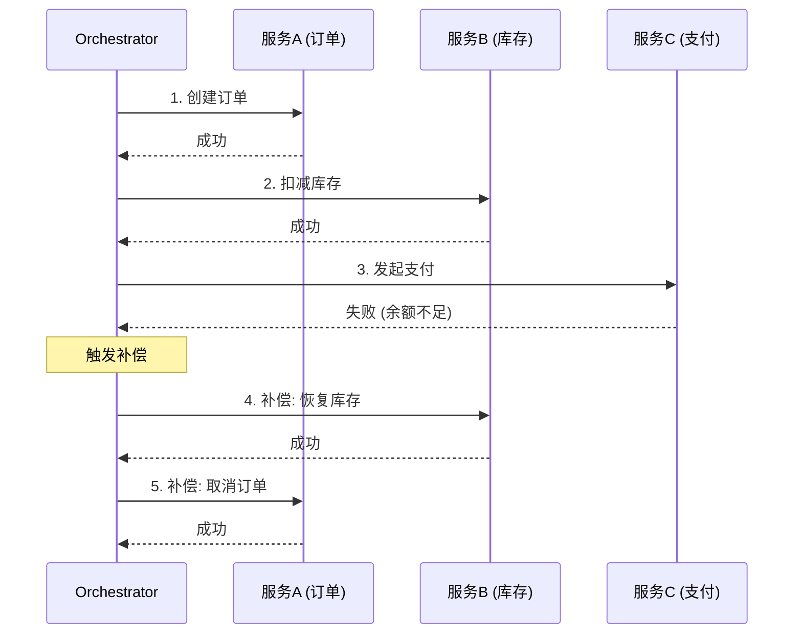

# Integration Design

跨系统集成方案设计引擎 — 设计系统间如何通信、如何保证数据一致性、如何应对故障。

## 核心理念

现代系统很少是孤岛。大多数项目涉及多个系统（内部微服务、第三方 API、遗留系统）的集成。集成设计回答：
1. **系统间怎么通信** — 同步还是异步？API 还是消息？
2. **数据怎么保持一致** — 强一致性还是最终一致性？
3. **故障怎么处理** — 熔断、降级、重试、补偿？
4. **怎么安全上线** — 灰度、回滚、监控？

> **定位与分工（与 `csp-tech-solution-design` 的区别）：**
> - `csp-tech-solution-design` 的接口架构章节覆盖**系统内部** API 架构（风格选择、版本策略、鉴权）
> - `csp-integration-design` 覆盖**跨系统/跨服务**集成（接口契约、数据一致性、故障隔离、灰度发布）
> - 单系统项目可能不需要本 skill；多系统项目在 tech-solution-design 之后使用本 skill 设计集成方案

## 输入

- `.csp/tech-design/ARCHITECTURE-DESIGN.md` — 系统架构（模块划分）
- `.csp/tech-design/INTERFACE-ARCHITECTURE.md` — 接口架构
- `.csp/decomposition/DECOMPOSITION-SUMMARY.md` — Feature 间依赖关系
- 外部系统文档（如有）

## 集成模式

### 1. 通信模式选择

| 模式 | 适用场景 | 协议 | 耦合度 | 可靠性 |
|------|---------|------|--------|--------|
| 同步 REST/gRPC | 实时查询、需要即时响应 | HTTP/HTTP2 | 高（调用方等待） | 低（下游挂上游挂） |
| 异步消息 | 事件通知、削峰填谷 | AMQP/Kafka | 低（发送即忘） | 高（消息持久化） |
| 事件驱动 | 多系统联动、数据同步 | Pub/Sub | 低（发布者不关心消费者） | 中（需处理重复/乱序） |
| 轮询 | 不支持推送的场景 | HTTP | 中（定时查询） | 低（延迟大） |
| Webhook | 外部系统回调 | HTTP | 中（依赖外部可达性） | 低（外部不可控） |
| 共享数据库 | 遗留系统集成 | SQL | 极高（共享 schema） | 中（schema 耦合） |

**决策框架：**

```
需要即时响应？
├── 是 → 同步 REST/gRPC
└── 否 → 需要可靠投递？
    ├── 是 → 异步消息
    └── 否 → 事件驱动
```

### 2. 接口契约设计

每个集成点必须定义明确的接口契约：

```yaml
integration:
  id: "INT-001"
  name: "文档搜索服务集成"
  description: "文档管理服务将文档变更事件发送给搜索服务，搜索服务索引后提供搜索 API"
  
  # 参与方
  producer:
    system: "文档管理服务"
    role: "事件发布者"
  consumer:
    system: "搜索服务"
    role: "事件消费者"
  
  # 通信方式
  communication:
    pattern: "event-driven"
    protocol: "AMQP (RabbitMQ)"
    exchange: "documents.events"
    routing_key: "document.{action}"
    
  # 事件定义
  events:
    - name: "document.created"
      payload:
        document_id: "UUID"
        title: "string"
        content: "string (摘要)"
        author_id: "UUID"
        created_at: "ISO8601"
    - name: "document.updated"
      payload: { ... }
    - name: "document.deleted"
      payload:
        document_id: "UUID"
        deleted_at: "ISO8601"
  
  # SLA
  sla:
    delivery_latency: "< 5s (P99)"
    availability: "99.9%"
    throughput: "100 events/s"
  
  # 错误处理
  error_handling:
    retry: { max_attempts: 3, backoff: "exponential" }
    dead_letter: "dlq.documents.events"
    alert: "DLQ 堆积 > 10 条"
```

### 3. 数据一致性策略

| 策略 | 一致性 | 性能 | 复杂度 | 适用场景 |
|------|--------|------|--------|---------|
| 2PC (两阶段提交) | 强一致 | 低 | 中 | 同数据库、低并发 |
| Saga (编排) | 最终一致 | 高 | 高 | 长事务、跨服务 |
| Saga ( choreography ) | 最终一致 | 高 | 中 | 事件驱动、松耦合 |
| TCC (Try-Confirm-Cancel) | 最终一致 | 中 | 高 | 资源预留场景 |
| 事件溯源 | 最终一致 | 高 | 很高 | 审计要求、状态重建 |
| 补偿事务 | 最终一致 | 中 | 中 | 简单补偿场景 |

**Saga 编排示例：**



### 4. 故障隔离策略

```yaml
resilience:
  circuit_breaker:
    # 熔断器
    library: "resilience4j / Polly / circuit_breaker"
    config:
      failure_threshold: 5        # 连续失败 5 次
      timeout: 30s                # 熔断 30 秒
      half_open_max: 3            # 半开状态最多 3 次尝试
    applies_to:
      - "第三方支付 API"
      - "AI 推理服务"
      - "外部搜索服务"
  
  retry:
    # 重试策略
    config:
      max_attempts: 3
      backoff: "exponential"      # 1s, 2s, 4s
      jitter: true                # 防惊群
    applies_to:
      - "临时网络错误"
      - "超时错误"
    not_for:
      - "业务逻辑错误"            # 重试不会改变结果
      - "幂等性不保证的操作"
  
  fallback:
    # 降级策略
    strategies:
      - service: "AI 问答服务"
        fallback: "返回静态 FAQ 结果"
      - service: "全文搜索"
        fallback: "降级到 PG FTS"
      - service: "推荐服务"
        fallback: "返回热门推荐"
      - service: "实时协作"
        fallback: "显示'协作暂不可用'提示"
  
  timeout:
    # 超时配置
    config:
      default: 10s
      ai_service: 30s
      search: 5s
      payment: 15s
      notification: 3s
  
  bulkhead:
    # 舱壁隔离
    config:
      search_pool: { max_threads: 10, queue: 20 }
      ai_pool: { max_threads: 5, queue: 10 }
      notification_pool: { max_threads: 3, queue: 50 }
```

### 5. 灰度发布与回滚

```yaml
canary_release:
  # 灰度策略
  strategy:
    - phase: 1
      traffic: 5%               # 5% 流量
      duration: 30min
      monitor: [error_rate, latency, cpu]
      rollback_trigger: "error_rate > 1%"
    - phase: 2
      traffic: 25%              # 25% 流量
      duration: 1h
    - phase: 3
      traffic: 50%              # 50% 流量
      duration: 2h
    - phase: 4
      traffic: 100%             # 全量
      duration: persistent
  
  rollback:
    # 回滚方案
    strategy: "蓝绿部署 + 流量切换"
    trigger:
      auto: "error_rate > 阈值 OR latency p99 > 阈值"
      manual: "值班人员一键回滚"
    rto: "< 5 min"               # 恢复时间目标
    rpo: "0"                     # 恢复点目标（无数据丢失）
  
  data_migration:
    # 数据迁移兼容
    backward_compatible: true    # 新版本兼容旧数据
    forward_compatible: true     # 旧版本可读新数据
    migration_strategy: "expand-contract"  # 先加字段，后删旧字段
```

## 集成测试策略

```yaml
integration_test:
  levels:
    contract:
      # 契约测试
      tool: "Pact / Spring Cloud Contract"
      scope: "每个集成点"
      trigger: "接口变更时"
    
    component:
      # 组件集成测试
      tool: "Testcontainers / Docker Compose"
      scope: "关键集成路径"
      trigger: "每次 PR"
    
    e2e:
      # 端到端测试
      tool: "Playwright / Cypress"
      scope: "核心用户流程"
      trigger: "发布前"
    
    chaos:
      # 混沌测试
      tool: "Chaos Monkey / Gremlin"
      scope: "故障演练"
      trigger: "定期（每月）"
```

## 输出产物

```
.csp/tech-design/
├── INTEGRATION-DESIGN.md       # 集成方案设计
├── INTEGRATION-CONTRACTS/      # 接口契约
│   ├── INT-001-search-service.md
│   ├── INT-002-notification-service.md
│   └── ...
└── INTEGRATION-TEST-PLAN.md    # 集成测试计划
```

## 门控检查

- [ ] 每个集成点有明确的接口契约
- [ ] 每个集成点有 SLI/SLO 定义
- [ ] 数据一致性策略已确定（强一致/最终一致/Saga）
- [ ] 故障隔离策略已配置（熔断/重试/降级/超时）
- [ ] 灰度发布方案已制定
- [ ] 回滚方案已制定且 RTO < 5min
- [ ] 集成测试策略已覆盖关键路径

## 完成信号

```yaml
completion_signal:
  output: .csp/tech-design/INTEGRATION-DESIGN.md
  next_step:
    recommended: csp-tech-design-review
    alternatives: [csp-tech-task-breakdown]
  status:
    integration_contracts: "{{count}}"
    phase: plan
    ready_for: [tech-design-review, task-breakdown]
```

## 与其他 Skill 的协作

| 上游 Skill | 提供什么 |
|-----------|---------|
| csp-tech-solution-design | 系统架构（模块划分、依赖关系） |

| 下游 Skill | 消费什么 |
|-----------|---------|
| csp-tech-design-review | 集成方案（评审） |
| csp-tech-task-breakdown | 集成任务（纳入开发计划） |
| csp-tech-risk-assessment | 集成风险（识别和评估） |

## 快速开始示例

```
输入: 知识库系统，涉及 4 个内部模块 + 2 个外部服务

集成设计:
  INT-001: 文档 → 搜索服务 (事件驱动)
    - 文档变更时发布事件到 RabbitMQ
    - 搜索服务消费事件，更新索引
    - 一致性: 最终一致（允许秒级延迟）
    - 降级: 搜索不可用时降级到 PG FTS
  
  INT-002: 文档 → AI 问答服务 (同步 API)
    - 用户提问时同步调用 AI 服务
    - 超时 30s，熔断器保护
    - 降级: 返回静态 FAQ
  
  INT-003: 用户 → 通知服务 (异步消息)
    - 关注/评论/协作邀请时发送通知
    - 多渠道: 站内信 + 邮件 + 推送
  
  灰度方案:
    Phase 1: 5% 流量 (30min) → Phase 2: 25% (1h) → Phase 3: 100%
    回滚: 蓝绿部署，流量切换 < 5min
```