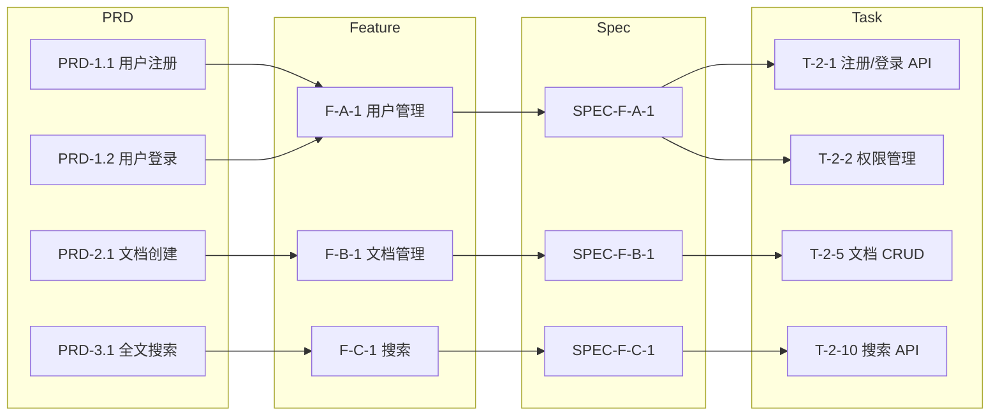

# PRD Traceability

PRD 到技术实现的完整追溯矩阵引擎 — 确保每个需求都有对应的实现，每个实现都有对应的需求。

## 核心理念

追溯矩阵回答三个问题：
1. **这个需求有人实现吗？** — 正向追溯：PRD → Feature → Spec → Task → Code
2. **这个代码对应哪个需求？** — 反向追溯：Code → Task → Spec → Feature → PRD
3. **有没有遗漏？** — 覆盖率分析：哪些 PRD 条目没有对应的 Feature/Spec/Task

没有追溯矩阵的后果：
- PRD 写了但没人实现 → 需求遗漏
- 代码写了但没对应需求 → 范围蔓延
- 需求变更时不知道影响哪些代码 → 变更风险

## 输入

- `docs/prd/PRD-*.md` — PRD 文档
- `.csp/decomposition/FEATURE-DETAILS/*.yaml` — Feature 定义
- `.csp/specs/SPEC-F-*.md` — 全栈 Spec（如有）
- `.csp/tasks/TASK-CARDS/*.md` — 任务卡片（如有）

## 追溯层级

```
PRD Entry (PRD 条目)
  │
  ├── 1:1 ──→ Feature (功能)
  │              │
  ├── 1:N ──→ Feature (功能)  ← 一个 PRD 条目拆成多个 Feature
  │              │
  └── N:1 ──→ Feature (功能)  ← 多个 PRD 条目合并为一个 Feature
                 │
                 ├── 1:1 ──→ Spec (技术规格)
                 │              │
                 ├── 1:N ──→ Spec (技术规格)
                 │              │
                 └── N:1 ──→ Spec (技术规格)
                                │
                                ├── 1:1 ──→ Task (开发任务)
                                └── 1:N ──→ Task (开发任务)
```

## 追溯矩阵

### 正向追溯 (Forward Traceability)

```markdown
## Forward Traceability Matrix

| PRD Entry | Feature | Spec | Task | Code | 状态 |
|-----------|---------|------|------|------|------|
| PRD-1.1 用户注册 | F-A-1 | SPEC-F-A-1 | T-2-1, T-2-2 | auth/register.py | ✅ |
| PRD-1.2 用户登录 | F-A-1 | SPEC-F-A-1 | T-2-1 | auth/login.py | ✅ |
| PRD-1.3 密码重置 | F-A-1 | SPEC-F-A-1 | T-2-4 | auth/reset.py | ✅ |
| PRD-2.1 文档创建 | F-B-1 | SPEC-F-B-1 | T-2-5, T-3-2 | docs/create.py | ✅ |
| PRD-2.2 文档编辑 | F-B-1 | SPEC-F-B-1 | T-2-6 | docs/edit.py | ⚠️ 进行中 |
| PRD-2.3 实时协作 | F-B-2 | SPEC-F-B-2 | - | - | ❌ 未开始 |
| PRD-3.1 全文搜索 | F-C-1 | SPEC-F-C-1 | T-2-10 | search/fulltext.py | ✅ |
| PRD-3.2 AI 问答 | F-C-2 | - | - | - | ❌ 未开始 |
```

### 反向追溯 (Backward Traceability)

```markdown
## Backward Traceability Matrix

| Code | Task | Spec | Feature | PRD Entry | 状态 |
|------|------|------|---------|-----------|------|
| auth/register.py | T-2-1 | SPEC-F-A-1 | F-A-1 | PRD-1.1 | ✅ 有对应需求 |
| auth/login.py | T-2-1 | SPEC-F-A-1 | F-A-1 | PRD-1.2 | ✅ 有对应需求 |
| ??? | - | - | - | - | ❌ 无对应需求（范围蔓延） |
```

## 覆盖率分析

### 需求覆盖率

```markdown
## Requirement Coverage

### PRD 条目覆盖率
| 指标 | 数值 |
|------|------|
| PRD 总条目数 | 15 |
| 有 Feature 的条目 | 15 (100%) |
| 有 Spec 的条目 | 12 (80%) |
| 有 Task 的条目 | 10 (66.7%) |
| 有 Code 的条目 | 8 (53.3%) |

### Feature 覆盖率
| 指标 | 数值 |
|------|------|
| Feature 总数 | 12 |
| 有 PRD 来源的 Feature | 12 (100%) |
| 有 Spec 的 Feature | 10 (83.3%) |
| 有 Task 的 Feature | 8 (66.7%) |

### 缺口分析
| 类型 | 条目 | 原因 | 建议 |
|------|------|------|------|
| 无 Spec | PRD-3.2 (AI 问答) | 技术方案未确定 | 先进行技术方案设计 |
| 无 Task | PRD-2.3 (实时协作) | P2 功能，下一迭代 | 确认迭代计划 |
| 无 Task | PRD-3.2 (AI 问答) | 依赖 Spec | 先生成 Spec |
```

### 覆盖率检查规则

```yaml
coverage_rules:
  # 正向覆盖率目标
  forward:
    prd_to_feature: 100%      # 每个 PRD 条目必须有 Feature
    prd_to_spec: 100%         # 每个 P0/P1 Feature 必须有 Spec
    spec_to_task: 100%        # 每个 Spec 必须有 Task
    task_to_code: 100%        # 每个 Task 必须有 Code
  
  # 反向覆盖率目标
  backward:
    code_to_prd: 100%         # 每个 Code 必须能追溯到 PRD
    feature_to_prd: 100%      # 每个 Feature 必须有 PRD 来源
  
  # 允许的缺口
  allowed_gaps:
    - P2 Feature 可以不生成 Spec（MVP 阶段）
    - 下一迭代的 Feature 可以不生成 Task
    - 基础设施代码可以追溯到"基础设施需求"分类
```

## 追溯图

### Mermaid 追溯图



## 输出产物

```
.csp/traceability/
├── FORWARD-MATRIX.md          # 正向追溯矩阵
├── BACKWARD-MATRIX.md         # 反向追溯矩阵
├── COVERAGE-REPORT.md         # 覆盖率报告
├── GAP-ANALYSIS.md            # 缺口分析
├── TRACEABILITY-GRAPH.md      # 追溯图 (Mermaid)
└── TRACEABILITY-SUMMARY.md    # 追溯摘要
```

## 门控检查

- [ ] 正向追溯：每个 PRD 条目有对应的 Feature
- [ ] 正向追溯：每个 P0/P1 Feature 有对应的 Spec
- [ ] 反向追溯：每个 Feature 有 PRD 来源
- [ ] 覆盖率：PRD→Feature 覆盖率 = 100%
- [ ] 缺口分析：所有缺口有明确原因和解决计划

## 完成信号

```yaml
completion_signal:
  output: .csp/traceability/TRACEABILITY-SUMMARY.md
  next_step:
    recommended: csp-prd-change-impact
    alternatives: [csp-tech-task-breakdown]
  status:
    traceability_path: .csp/traceability/
    prd_coverage: "{{percentage}}"
    feature_coverage: "{{percentage}}"
    total_gaps: "{{count}}"
    phase: review
    ready_for: [change-impact-analysis, task-breakdown]
```

## 与其他 Skill 的协作

| 上游 Skill | 提供什么 |
|-----------|---------|
| csp-prd-generation | PRD 文档 |
| csp-requirement-decomposition | Feature 定义 |
| csp-fullstack-spec-generator | Spec 文档 |
| csp-tech-task-breakdown | Task 卡片 |

| 下游 Skill | 消费什么 |
|-----------|---------|
| csp-prd-change-impact | 追溯矩阵（变更影响分析的基础） |
| csp-tech-task-breakdown | 覆盖率报告（检查缺失任务） |

## 快速开始示例

```
输入: 知识库系统 PRD 4 个 Feature

输出:
  正向追溯: 15 个 PRD 条目 → 12 个 Feature → 10 个 Spec → 40 个 Task
  反向追溯: 40 个 Task → 10 个 Spec → 12 个 Feature → 15 个 PRD 条目
  覆盖率:
    PRD→Feature: 100% (15/15)
    PRD→Spec: 80% (12/15) — 3 个 P2 条目暂不生成 Spec
    PRD→Task: 66.7% (10/15) — 5 个条目在下一迭代
  缺口:
    - PRD-2.3 实时协作 (P2, 下一迭代)
    - PRD-3.2 AI 问答 (待技术方案确定)
    - PRD-4.1 数据分析面板 (P2, 下一迭代)
```