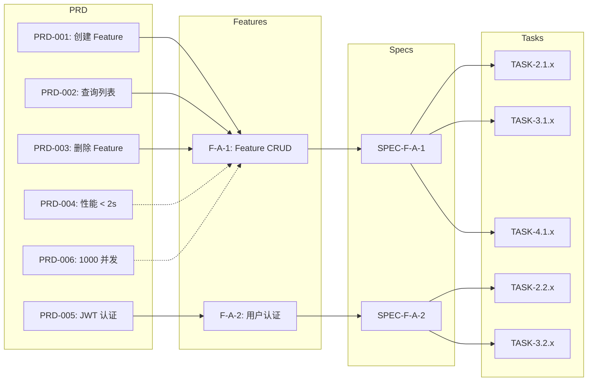

# PRD Traceability

建立 PRD → Feature → Spec → Task 的完整追溯链，确保每个需求都有对应的实现，每个实现都有需求来源。

## 核心理念

需求追溯矩阵(RTM)是需求质量的"安全网"：
1. **向前追溯** — 每个 PRD 需求是否都有 Feature 对应？
2. **向后追溯** — 每个 Feature 是否都有 PRD 需求来源？
3. **覆盖率检查** — 是否所有 PRD 需求都被覆盖？是否有遗漏？
4. **变更影响** — 修改某个 PRD 需求，会影响哪些 Feature/Spec/Task？

## 输入

- `docs/prd/PRD-*.md` — PRD 文档
- `.csp/decomposition/FEATURE-DETAILS/*.yaml` — Feature 拆解
- `.csp/specs/SPEC-*.md` — Feature Spec（如已有）
- `.csp/tasks/TASK-CARDS/*.md` — 开发任务（如已有）

## 执行流程

### Phase 1: PRD 需求条目提取

从 PRD 文档中提取所有可追溯的需求条目：

```markdown
## PRD 需求条目

### 来源: docs/prd/PRD-feature-management.md

| 需求 ID | 需求描述 | 优先级 | 来源章节 | 类型 |
|---------|---------|--------|---------|------|
| PRD-001 | 用户可创建 Feature 并填写标题、描述 | P0 | 3.1 Feature 创建 | 功能需求 |
| PRD-002 | 用户可查看 Feature 列表，支持分页和筛选 | P0 | 3.2 Feature 列表 | 功能需求 |
| PRD-003 | 只有管理员可删除 Feature | P0 | 3.3 Feature 删除 | 功能需求 |
| PRD-004 | Feature 列表加载时间 < 2 秒 | P1 | 4. 非功能需求 | 性能需求 |
| PRD-005 | 用户操作需通过 JWT 认证 | P0 | 4. 非功能需求 | 安全需求 |
| PRD-006 | 支持 1000 并发用户同时访问 | P1 | 4. 非功能需求 | 性能需求 |
```

### Phase 2: 追溯关系建立

建立 PRD 条目到 Feature 的映射：

```markdown
## 追溯矩阵 (RTM)

### Level 1: PRD → Feature

| 需求 ID | Feature ID | 覆盖状态 | 备注 |
|---------|-----------|---------|------|
| PRD-001 | F-A-1 (Feature 创建) | ✅ 已覆盖 | 直接对应 |
| PRD-002 | F-A-1 (Feature 创建) | ✅ 已覆盖 | 列表功能包含在内 |
| PRD-003 | F-A-1 (Feature 创建) | ✅ 已覆盖 | 权限控制部分 |
| PRD-004 | F-A-1 (Feature 创建) | ⚠️ 部分覆盖 | 未明确指定缓存策略 |
| PRD-005 | F-A-2 (用户认证) | ✅ 已覆盖 | 直接对应 |
| PRD-006 | F-A-1, F-A-2 | ⚠️ 部分覆盖 | 未明确压测方案 |

### Level 2: Feature → Spec

| Feature ID | Spec ID | 覆盖状态 | 备注 |
|-----------|---------|---------|------|
| F-A-1 | SPEC-F-A-1.md | ✅ 已覆盖 | 完整 Spec |
| F-A-2 | SPEC-F-A-2.md | ✅ 已覆盖 | 完整 Spec |

### Level 3: Spec → Task

| Spec ID | Task ID | 覆盖状态 | 备注 |
|---------|---------|---------|------|
| SPEC-F-A-1.md | TASK-2.1.1-2.2.3 | ✅ 已覆盖 | 数据层任务 |
| SPEC-F-A-1.md | TASK-3.1.1-3.1.5 | ✅ 已覆盖 | 后端 API 任务 |
| SPEC-F-A-1.md | TASK-4.1.1-4.1.4 | ✅ 已覆盖 | 前端 UI 任务 |
| SPEC-F-A-2.md | TASK-2.2.4-2.2.6 | ✅ 已覆盖 | 数据层任务 |
| SPEC-F-A-2.md | TASK-3.2.1-3.2.4 | ✅ 已覆盖 | 后端 API 任务 |
```

### Phase 3: 覆盖率分析

```markdown
## 覆盖率分析

### 功能需求覆盖
| 总数 | 已覆盖 | 部分覆盖 | 未覆盖 | 覆盖率 |
|------|--------|---------|--------|--------|
| 6 | 3 | 2 | 1 | 50% (83%) |

### 未覆盖需求
| 需求 ID | 需求描述 | 缺失原因 | 建议 |
|---------|---------|---------|------|
| (示例) | | | |

### 部分覆盖需求
| 需求 ID | 需求描述 | 缺失部分 | 补全建议 |
|---------|---------|---------|---------|
| PRD-004 | 列表加载 < 2s | 未指定缓存策略 | 在 SPEC-F-A-1 中增加缓存架构 |
| PRD-006 | 1000 并发 | 未指定压测方案 | 增加 NFR 测试 Spec |

### 覆盖冗余 (Feature 无 PRD 来源)
| Feature ID | 描述 | 分析 |
|-----------|------|------|
| (如有) | | 可能是隐含需求或过度设计 |
```

### Phase 4: 追溯图

```markdown
## 追溯关系图 (Mermaid)



图例: 实线 = 已覆盖, 虚线 = 部分覆盖, 红色虚线 = 未覆盖
```

### Phase 5: 缺口分析

```markdown
## 缺口分析

### 需求缺口 (PRD 有但 Feature 无)
| 需求 ID | 需求描述 | 影响 | 建议 |
|---------|---------|------|------|

### 实现缺口 (Feature 有但 Spec 无)
| Feature ID | 描述 | 影响 | 建议 |
|-----------|------|------|------|

### 执行缺口 (Spec 有但 Task 无)
| Spec ID | 描述 | 影响 | 建议 |
|---------|------|------|------|

### 过度设计 (Feature 有但 PRD 无)
| Feature ID | 描述 | 判断 | 建议 |
|-----------|------|------|------|
```

### Phase 6: 输出产物

```
.csp/traceability/
├── RTM.md                      # 追溯矩阵
├── COVERAGE-ANALYSIS.md        # 覆盖率分析
├── TRACEABILITY-GRAPH.md       # 追溯关系图
├── GAP-ANALYSIS.md             # 缺口分析
└── TRACEABILITY-SUMMARY.md     # 追溯摘要
```

## 追溯矩阵的维护

```yaml
maintenance:
  triggers:
    prd_changed: "重新运行 Phase 1-2，更新 PRD 条目和映射"
    feature_added: "追加新的 Feature 映射"
    feature_removed: "标记为已删除，检查是否有需求成为孤儿"
    spec_added: "追加 Spec 映射"
    task_added: "追加 Task 映射"
  review_frequency: "每个里程碑回顾一次"
```

## 完成信号

```yaml
completion_signal:
  output: .csp/traceability/TRACEABILITY-SUMMARY.md
  next_step:
    full_coverage: csp-tech-solution-design
    has_gaps: "先补全缺口，再进入技术方案设计"
  status:
    traceability_path: .csp/traceability/
    prd_items: "{{count}}"
    features: "{{count}}"
    coverage_rate: "{{rate}}%"
    gaps: "{{count}}"
    phase: verify
    ready_for: [tech-solution-design, gap-resolution]
```

## 关键原则

1. **双向追溯** — 每个需求可追踪到实现，每个实现可追溯到需求
2. **缺口即风险** — 未覆盖的需求 = 将来会出现的 Bug
3. **过度设计也是问题** — 无 PRD 来源的 Feature 可能是范围蔓延
4. **追溯矩阵是活的** — PRD 变更时同步更新
5. **覆盖率不是目的** — 100% 覆盖率不等于 100% 正确性，但 < 100% 覆盖率一定有遗漏