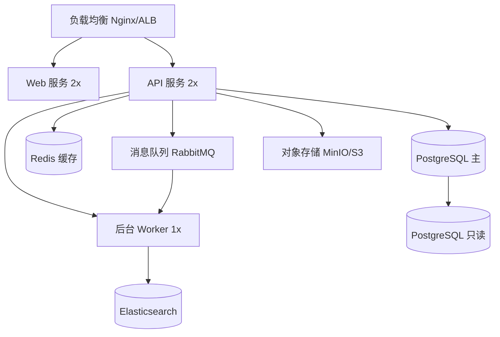
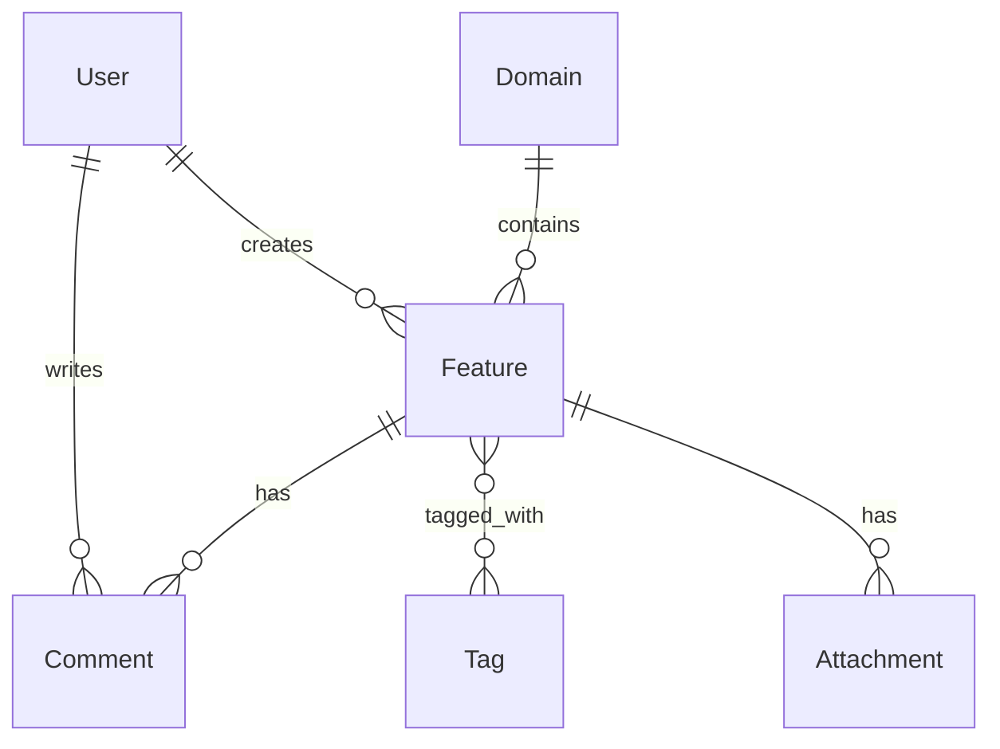

# Tech Solution Design

技术方案设计引擎 — 从需求拆解和技术选型出发，生成系统级 TDD（Technical Design Document）。

## 核心理念

技术方案设计是需求到代码之间的关键桥梁。它回答的不是"这个功能做什么"（那是 PRD 的事），也不是"用什么技术"（那是 tech-stack-advisor 的事），而是"这个系统怎么搭、组件怎么放、数据怎么流、接口怎么接"。

好的技术方案应该让任何开发者在拿到后能**直接理解系统全貌**，而不需要猜测架构意图。

## 定位与分工

```
┌──────────────────────────────────────────────────────────────────┐
│                     csp-tech-solution-design                       │
│                     (设计层 — 系统架构 + 数据 + 接口 + 安全)        │
├──────────────────────────────────────────────────────────────────┤
│                                                                    │
│  上游: csp-requirement-decomposition  → Feature 清单 + 依赖图     │
│         csp-tech-stack-advisor        → 技术栈全景 + ADR           │
│         csp-product-capability        → 产品约束/不变量             │
│                                                                    │
│  本 Skill: 系统架构设计 + 数据架构 + 接口架构 + 安全架构 + 方案对比 │
│                                                                    │
│  下游: csp-tech-design-review        → 多角色评审                   │
│         csp-fullstack-spec-generator  → 全栈 Spec                   │
│         csp-tech-task-breakdown       → 任务拆解                    │
│                                                                    │
└──────────────────────────────────────────────────────────────────┘
```

## 输入

消费上游产物：
- `.csp/decomposition/DECOMPOSITION-SUMMARY.md` — Feature 清单 + 技术维度汇总
- `.csp/decomposition/FEATURE-DETAILS/*.yaml` — 每个 Feature 的定义
- `.csp/tech-decisions/TECH-STACK-OVERVIEW.md` — 技术栈全景
- `.csp/tech-decisions/ADR/*.md` — 架构决策记录
- `PRODUCT.md` 或 capability contract — 产品约束/不变量（如有）

## 设计维度

### 1. 系统架构设计

#### 1.1 架构风格选择

| 架构风格 | 适用场景 | 优势 | 劣势 |
|---------|---------|------|------|
| 模块化单体 | 小团队、早期验证、简单业务 | 开发快、部署简单、调试方便 | 扩展性受限 |
| 分层架构 | 中等复杂度、标准业务 | 职责清晰、易于理解 | 层间耦合 |
| 微服务 | 大团队、独立部署、高扩展 | 独立部署、技术异构 | 运维复杂、分布式挑战 |
| 事件驱动 | 异步解耦、高吞吐、多系统 | 松耦合、可扩展 | 调试困难、最终一致性 |
| CQRS | 读写分离、复杂查询 | 读写优化、独立扩展 | 复杂度高 |
| 六边形架构 | 核心业务独立、高可测性 | 领域逻辑隔离 | 前期投入大 |

**决策依据：**
- 团队规模：≤5 人 → 模块化单体/分层架构；5-20 人 → 微服务选型评估；>20 人 → 微服务/事件驱动
- 扩展需求：单机可承载 → 单体；需独立扩展 → 微服务
- 业务复杂度：简单 CRUD → 分层架构；复杂领域 → 六边形/DDD

#### 1.2 服务/模块划分

```markdown
## 模块划分

### 模块 A: 用户与认证
- 职责：用户注册、登录、权限管理、会话管理
- 边界：不涉及业务数据，仅提供身份和权限服务
- 对外接口：REST API（用户 CRUD、登录/登出、Token 刷新）
- 内部接口：gRPC（权限校验）

### 模块 B: 核心业务
- 职责：业务实体 CRUD、业务规则引擎、工作流编排
- 边界：核心业务逻辑，不包含通知/搜索等辅助功能
- 对外接口：REST API（业务 CRUD、批量操作、导出）
- 内部接口：事件发布（业务变更通知）

### 模块 C: 搜索与智能
- 职责：全文搜索、语义搜索、AI 问答、推荐
- 边界：不直接修改业务数据，只读+索引
- 对外接口：REST API（搜索、推荐）
- 内部接口：消费业务变更事件更新索引

### 模块 D: 通知与集成
- 职责：消息推送、邮件、第三方集成
- 边界：不包含业务逻辑，仅负责消息路由和投递
- 对外接口：REST API（通知配置、发送状态）
- 内部接口：消费各类事件并投递
```

#### 1.3 部署拓扑



### 2. 数据架构设计

#### 2.1 全局 ER 图



#### 2.2 核心实体清单

| 实体 | 表名 | 预估量级 | 增长速率 | 存储引擎 |
|------|------|---------|---------|---------|
| User | users | 10K | 低 | PostgreSQL |
| Feature | features | 50K | 中 | PostgreSQL |
| Comment | comments | 500K | 高 | PostgreSQL (分区) |
| Tag | tags | 1K | 低 | PostgreSQL |
| Attachment | attachments | 100K | 中 | 元数据 PG + 文件 S3 |

#### 2.3 数据流图

```
用户请求 → API Gateway → 业务服务 → 主库(写)
                    ↓
               缓存(读) ← 业务服务 ← 只读库(读)
                    ↓
               事件总线 → 搜索索引(异步更新)
                        → 通知服务(异步投递)
                        → 审计日志(异步记录)
```

#### 2.4 数据一致性策略

| 场景 | 策略 | 理由 |
|------|------|------|
| 业务数据 CRUD | 强一致性（事务） | 核心数据不允许不一致 |
| 搜索索引更新 | 最终一致性（事件+重试） | 允许秒级延迟 |
| 缓存失效 | 写穿透 + TTL | 防止缓存与 DB 不一致 |
| 跨服务操作 | Saga 编排 | 长事务需要补偿机制 |

### 3. 接口架构设计

> **定位与分工：** 本节仅覆盖系统内部接口架构（API 风格选择、版本策略、鉴权体系）。跨系统集成方案（接口契约、数据一致性、故障隔离、灰度发布）由 `csp-integration-design` 负责。如果项目涉及多个系统/服务间的集成，在完成本设计后应继续使用 `csp-integration-design`。

#### 3.1 接口风格选择

| 接口类型 | 使用场景 | 协议 |
|---------|---------|------|
| REST API | 前端↔后端、外部集成 | HTTP/JSON |
| gRPC | 服务间高性能调用 | HTTP/2 + Protobuf |
| GraphQL | 灵活数据查询、移动端 | HTTP/JSON |
| WebSocket | 实时推送、协作编辑 | WS |
| 消息队列 | 异步解耦、事件驱动 | AMQP/Kafka |
| Webhook | 第三方回调 | HTTP/JSON |

#### 3.2 API 版本策略

- URL 路径版本：`/api/v1/`, `/api/v2/`
- 破坏性变更必须新版本
- 旧版本至少维护 6 个月
- 废弃接口提前 3 个月标记 `Deprecated` header

#### 3.3 接口鉴权体系

```
                     ┌─────────────┐
                     │  Auth Service│
                     └──────┬──────┘
                            │ JWT 签发/验证
              ┌─────────────┼─────────────┐
              ▼             ▼             ▼
         REST API       gRPC 拦截器    WebSocket
         Bearer Token   Metadata       Token in handshake
```

### 4. 安全架构设计

#### 4.1 安全分层

| 层级 | 安全措施 | 实现 |
|------|---------|------|
| 网络层 | HTTPS/TLS 1.3, WAF, DDoS 防护 | Nginx/CDN |
| 应用层 | 输入校验、输出编码、CORS、CSP | 框架中间件 |
| 认证层 | JWT + Refresh Token、MFA | 认证服务 |
| 授权层 | RBAC/ABAC、API 限流 | 权限中间件 |
| 数据层 | 传输加密、静态加密、脱敏、审计 | 数据库/应用 |
| 运维层 | 密钥管理、漏洞扫描、安全审计 | KMS/CI |

#### 4.2 威胁建模 (STRIDE)

| 威胁类型 | 示例 | 缓解措施 |
|---------|------|---------|
| 欺骗 (Spoofing) | 伪造 JWT | Token 签名验证 + 短有效期 |
| 篡改 (Tampering) | 修改请求参数 | 输入校验 + 签名 |
| 否认 (Repudiation) | 删除操作后否认 | 审计日志 + 不可删除 |
| 信息泄露 (Info Disclosure) | API 返回敏感字段 | 响应过滤 + 脱敏 |
| 拒绝服务 (DoS) | 大量请求 | 限流 + WAF + CDN |
| 提权 (Elevation) | 普通用户调用管理接口 | RBAC + API 鉴权 |

### 5. 关键技术难点攻克方案

每个难点独立成节：

```markdown
### 难点 1: 实时协作冲突解决

**问题描述：** 多用户同时编辑同一文档时如何解决冲突？

**方案对比：**
| 方案 | 原理 | 优势 | 劣势 | 复杂度 |
|------|------|------|------|--------|
| OT (Operational Transformation) | 操作变换 | 成熟、实时 | 依赖中心服务器 | 高 |
| CRDT (Conflict-free Replicated Data Types) | 无冲突数据结构 | 去中心化、离线 | 内存开销 | 高 |
| 乐观锁 + 合并 | 版本号+三路合并 | 简单、可控 | 冲突需手动解决 | 中 |

**推荐方案：** 乐观锁 + 自动合并（MVP 阶段）
- 每个文档带 `version` 字段
- 保存时检查版本，冲突时尝试自动合并文本
- 自动合并失败时提示用户手动解决
- 后续可升级到 CRDT（根据协作频率决定）

**关键技术指标：**
- 冲突检测延迟：< 100ms
- 自动合并成功率：> 80%（文本类文档）
- 手动冲突解决 UI 响应：< 2s
```

### 6. 多方案对比分析

对关键技术决策，至少提供 2 个候选方案并做出推荐：

```markdown
## 方案对比：前后端通信方式

| 维度 | REST API | GraphQL | 混合方案 |
|------|----------|---------|---------|
| 开发效率 | 高（标准） | 中（学习成本） | 中 |
| 性能 | 中（可能过度获取） | 高（按需查询） | 高 |
| 缓存 | 简单（HTTP 缓存） | 复杂（需 Persisted Queries） | 中 |
| 工具生态 | 成熟 | 成熟 | 需整合 |
| 移动端适配 | 需多个端点 | 天然适配 | 中 |
| 团队能力 | 常见 | 需学习 | 需学习 |

**推荐：** 混合方案
- 核心 CRUD → REST API（标准化、缓存简单）
- 复杂查询/移动端 → GraphQL（按需查询）
- 实时推送 → WebSocket（独立通道）
```

## 输出产物

```
.csp/tech-design/
├── ARCHITECTURE-DESIGN.md       # 系统架构设计（含架构图、模块划分、部署拓扑）
├── DATA-ARCHITECTURE.md         # 数据架构设计（ER 图、数据流、一致性策略）
├── INTERFACE-ARCHITECTURE.md    # 接口架构设计（API 风格、版本、鉴权）
├── SECURITY-ARCHITECTURE.md     # 安全架构设计（威胁建模、安全分层）
├── KEY-CHALLENGES.md            # 关键技术难点攻克方案
├── SOLUTION-COMPARISON.md       # 多方案对比分析
└── TECH-DESIGN-SUMMARY.md       # 技术方案摘要（供下游消费）
```

## 执行流程

```
1. 读取上游产物（decomposition + tech-decisions + capability contract）
2. 识别架构风格（单体/微服务/事件驱动）
3. 设计系统架构（模块划分 + 部署拓扑）
4. 设计数据架构（ER 图 + 数据流 + 一致性策略）
5. 设计接口架构（风格 + 版本 + 鉴权）
6. 设计安全架构（威胁建模 + 分层防护）
7. 识别关键技术难点并设计攻克方案
8. 对关键决策做多方案对比
9. 输出全套产物到 .csp/tech-design/
10. 门控检查
```

## 门控检查

- [ ] 系统架构设计完成（服务/模块划分 + 部署拓扑）
- [ ] 数据架构设计完成（全局 ER 图 + 数据流）
- [ ] 接口架构设计完成（API 风格 + 鉴权方案）
- [ ] 安全架构设计完成（威胁建模 + 缓解措施）
- [ ] 每个关键技术难点有攻克方案
- [ ] 至少 2 个关键决策做了多方案对比并有结论
- [ ] 技术方案与上游技术选型一致

## 完成信号

```yaml
completion_signal:
  output: .csp/tech-design/TECH-DESIGN-SUMMARY.md
  next_step:
    recommended: csp-tech-design-review
    alternatives: [csp-tech-task-breakdown, csp-fullstack-spec-generator]
  status:
    tech_design_path: .csp/tech-design/
    phase: plan
    ready_for: [tech-design-review, task-breakdown, spec-generation]
```

## 与其他 Skill 的协作

| 上游 Skill | 提供什么 |
|-----------|---------|
| csp-requirement-decomposition | Feature 清单 + 依赖图 + 技术维度 |
| csp-tech-stack-advisor | 技术栈全景 + ADR |
| csp-product-capability | 产品约束/不变量 |

| 下游 Skill | 消费什么 |
|-----------|---------|
| csp-tech-design-review | 全套技术方案产物（评审） |
| csp-fullstack-spec-generator | 系统架构 + 数据架构 + 接口架构（生成 Spec） |
| csp-tech-task-breakdown | 系统架构 + 模块划分（任务拆解） |

## 快速开始示例

```
用户: "帮我设计知识库系统的技术方案"

执行:
  1. 读取 .csp/decomposition/（Feature 清单、技术维度）
  2. 读取 .csp/tech-decisions/（技术栈：Python+FastAPI / Next.js / PG / Redis / Meilisearch）
  3. 识别架构风格：模块化单体 + 搜索服务独立
  4. 系统架构设计：4 个模块（用户/文档/搜索/通知）+ 部署拓扑
  5. 数据架构设计：7 个核心实体 + ER 图 + 数据流
  6. 接口架构设计：REST API + WebSocket（实时协作）+ 事件驱动（索引更新）
  7. 安全架构设计：JWT + RBAC + 威胁建模
  8. 关键技术难点：实时协作冲突解决（CRDT vs OT vs 乐观锁）
  9. 多方案对比：PG FTS vs Meilisearch vs Elasticsearch
  10. 输出 .csp/tech-design/ 全套产物
```