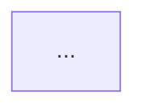
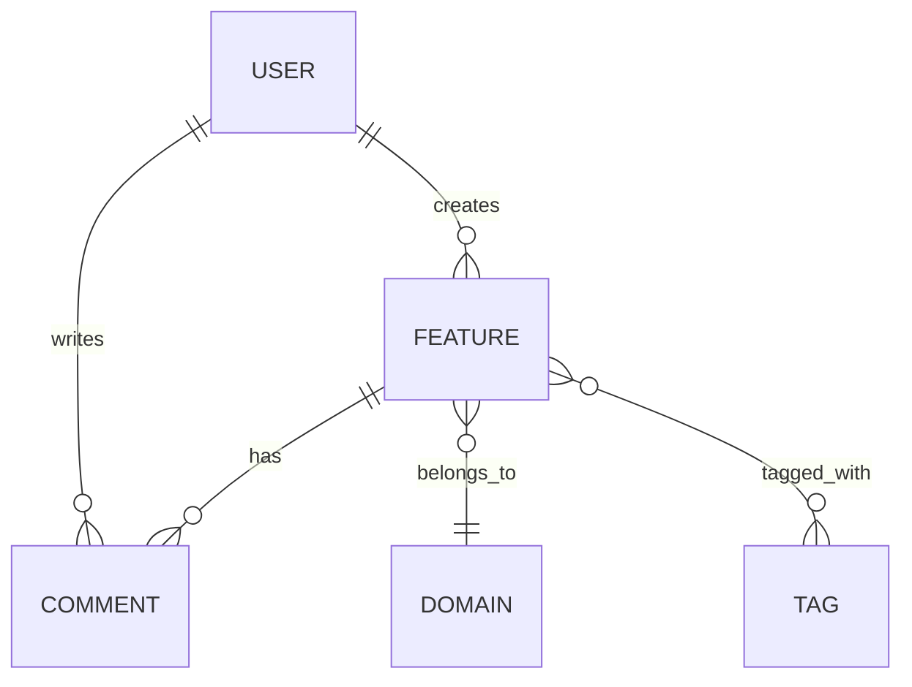

# Technical Solution Design

从 Feature 拆解、技术选型和产品能力约束出发，生成系统级技术方案文档。

## 核心理念

技术方案设计是"需求→代码"之间的关键桥梁。它回答三个问题：
1. **系统长什么样？** — 服务/模块划分、分层架构、部署拓扑
2. **系统如何运转？** — 数据流、接口契约、状态机、事件驱动
3. **为什么这么设计？** — 设计决策的理由、权衡、替代方案

一份好的技术方案(TDD)应该让任何开发者拿到后能理解系统的全貌，并知道自己的代码如何融入整体架构。

## 输入

消费上游产物：
- `.csp/decomposition/` — Feature 拆解产物（FEATURE-DETAILS、DEPENDENCY-GRAPH、NFR）
- `.csp/tech-decisions/` — 技术选型产物（TECH-STACK-OVERVIEW、ADR）
- PRODUCT.md / docs/product/ — 产品能力约束（capability contract）
- 现有代码库架构（如已有系统）

## 核心流程

### Phase 1: 系统上下文分析

在开始设计前，先确定系统的边界和约束：

```markdown
## System Context

### 系统边界
- 系统范围: [哪些功能在系统内，哪些在系统外]
- 外部依赖: [依赖的外部系统/服务]
- 集成方式: [API / 消息 / 事件 / 文件]

### 关键约束
- 技术约束: [技术栈限制、平台限制]
- 业务约束: [合规、数据主权、SLA]
- 交付约束: [时间线、团队规模、技能分布]
- 演进约束: [现有系统兼容、灰度策略、回滚要求]

### 架构质量属性
| 属性 | 目标 | 优先级 | 权衡对象 |
|------|------|--------|---------|
| 可用性 | 99.9%+ | P0 | 成本、复杂度 |
| 性能 | p99 < 200ms | P0 | 缓存一致性 |
| 可扩展性 | 10x 流量增长 | P1 | 初期复杂度 |
| 可维护性 | 新开发者 1周上手 | P1 | 抽象层级 |
| 安全性 | 无 CRITICAL 漏洞 | P0 | 开发速度 |
| 成本 | 月均 < ¥X | P2 | 冗余、性能 |
```

### Phase 2: 多方案设计

对关键设计决策，产出 2-3 个可行方案，结构化对比：

```markdown
## 方案对比

### 决策点 1: [决策名称，如"服务拆分粒度"]

#### 方案 A: [方案名称]
**描述:** [一句话描述]
**架构图:**


**优势:**
- [优势 1]
- [优势 2]

**劣势:**
- [劣势 1]
- [劣势 2]

**适用条件:**
- [什么场景下这个方案最优]

#### 方案 B: [方案名称]
...

#### 方案对比矩阵
| 维度 | 方案 A | 方案 B | 方案 C |
|------|--------|--------|--------|
| 架构复杂度 | 低 | 中 | 高 |
| 开发效率 | 快 | 中 | 慢 |
| 扩展性 | 中 | 高 | 高 |
| 运维成本 | 低 | 中 | 高 |
| 学习曲线 | 平缓 | 中等 | 陡峭 |

#### 推荐方案
**推荐:** 方案 A
**理由:** [基于约束条件的具体理由]
**风险:** [选此方案的风险]
```

### Phase 3: 系统架构设计

确定整体架构后，详细设计各层：

```markdown
## 系统架构

### 架构风格
- [微服务 / 模块化单体 / 事件驱动 / 分层架构 / 六边形架构 / CQRS / 等等]

### 服务/模块划分

| 服务/模块 | 职责 | 所属域 | 数据存储 | 关键依赖 |
|-----------|------|--------|---------|---------|
| user-svc | 用户认证/授权 | 用户管理 | PG: users | - |
| feature-svc | 核心业务 | 核心业务 | PG: features | user-svc |
| search-svc | 全文搜索 | 数据服务 | Meilisearch | feature-svc |
| notification-svc | 通知推送 | 基础设施 | Redis | user-svc |

### 分层架构

```
┌─────────────────────────────────────────────────────┐
│                  API Gateway / BFF                    │
├─────────────────────────────────────────────────────┤
│  ┌──────────┐  ┌──────────┐  ┌──────────────────┐  │
│  │  Service   │  │  Service   │  │   Infrastructure  │  │
│  │  Layer     │  │  Layer     │  │   Layer           │  │
│  │  (业务)    │  │  (集成)    │  │   (基础设施)      │  │
│  └──────────┘  └──────────┘  └──────────────────┘  │
├─────────────────────────────────────────────────────┤
│                  Data Layer                           │
│  ┌──────────┐  ┌──────────┐  ┌──────────────────┐  │
│  │  PG       │  │  Redis    │  │   Meilisearch     │  │
│  └──────────┘  └──────────┘  └──────────────────┘  │
└─────────────────────────────────────────────────────┘
```

### 部署拓扑 (Mermaid)

```mermaid
graph TB
    subgraph "客户端"
        WEB[Web App]
        APP[Mobile App]
    end
    subgraph "CDN"
        CDN[Cloudflare CDN]
    end
    subgraph "K8s Cluster"
        GW[API Gateway]
        US[user-svc: 2 pods]
        FS[feature-svc: 3 pods]
        NS[notification-svc: 1 pod]
        GW --> US
        GW --> FS
        FS --> NS
    end
    subgraph "Data Layer"
        PG[(PostgreSQL Primary)]
        PG_REPL[(PostgreSQL Replica)]
        RD[(Redis Cluster)]
        MS[(Meilisearch)]
    end
    WEB --> CDN --> GW
    APP --> GW
    US --> PG
    FS --> PG_REPL
    FS --> RD
    FS --> MS
```

### 关键技术难点

| 难点 | 方案 | 备选方案 |
|------|------|---------|
| [难点 1: 如"高并发写入"] | [方案描述] | [备选] |
| [难点 2: 如"分布式事务"] | [方案描述] | [备选] |
| [难点 3: 如"实时同步"] | [方案描述] | [备选] |
```

### Phase 4: 数据架构设计

```markdown
## 数据架构

### 全局 ER 图 (Mermaid)


### 核心数据流

| 数据流 | 来源 | 途径 | 目标 | 一致性要求 |
|--------|------|------|------|-----------|
| 用户创建 Feature | Web/App | API → service → PG | PostgreSQL | 强一致 |
| 搜索索引更新 | Feature 变更 | CDC → 消息队列 → search-svc | Meilisearch | 最终一致 |
| 通知推送 | Feature 变更 | 事件 → notification-svc → WebSocket | 用户 | 最终一致 |

### 数据治理策略

| 策略 | 说明 |
|------|------|
| 数据所有权 | 每个服务拥有自己的数据存储，不跨服务直接访问 DB |
| 数据保留 | 核心数据永久保留，日志 90 天，审计日志 365 天 |
| 数据归档 | 超过 1 年的数据归档到冷存储 |
| 数据隔离 | 多租户通过 tenant_id 行级隔离 |
| 加密策略 | 传输中 TLS 1.3，存储中 AES-256，PII 字段加密 |
```

### Phase 5: 接口架构设计

```markdown
## 接口架构

### 服务间通信

| 通信模式 | 协议 | 场景 | 示例 |
|---------|------|------|------|
| 同步请求 | gRPC / HTTP | 实时查询、命令 | user-svc → feature-svc |
| 异步事件 | Kafka / Redis Streams | 状态变更通知 | feature-svc → notification-svc |
| 定时任务 | Cron / Scheduler | 批量处理 | 每日报表生成 |

### API 网关策略

- 路由规则: [path → service 映射]
- 限流策略: [per-user / per-IP / per-service]
- 认证: [JWT / API Key / OAuth2]
- 版本管理: [URL 版本 / Header 版本]
- 熔断: [超时、重试、熔断参数]

### 异步消息契约

| 事件 | 生产者 | 消费者 | Payload 结构 | 保证等级 |
|------|--------|--------|-------------|---------|
| feature.created | feature-svc | search-svc, notification-svc | {id, title, status} | at-least-once |
| feature.updated | feature-svc | search-svc | {id, changes} | at-least-once |
| feature.deleted | feature-svc | search-svc | {id} | at-least-once |
```

### Phase 6: 安全架构设计

```markdown
## 安全架构

### 认证授权模型
- 认证: [JWT / Session / OAuth2 / SSO]
- 授权: [RBAC / ABAC / ReBAC]
- 角色/权限矩阵: [角色 → 权限 → 资源]

### 威胁模型 (STRIDE)
| 威胁类型 | 风险点 | 缓解措施 | 优先级 |
|---------|--------|---------|--------|
| 篡改 | API 请求伪造 | 请求签名验证 | P0 |
| 信息泄露 | PII 数据泄露 | 字段加密 + 访问审计 | P0 |
| 拒绝服务 | 接口被刷 | 限流 + WAF | P1 |
| 权限提升 | 越权访问 | 行级权限检查 | P0 |

### 数据安全
- 传输加密: TLS 1.3
- 存储加密: AES-256
- 密钥管理: KMS / Vault
- 日志脱敏: 自动过滤 PII 字段
```

### Phase 7: 关键技术难点详细方案

对系统中最复杂的 2-3 个技术难点，给出详细攻克方案：

```markdown
## 关键技术难点

### 难点 1: [名称]

**问题描述:**
[清晰描述问题]

**方案设计:**
[详细方案，含流程图]

**关键代码/伪代码:**
```
[核心实现逻辑]
```

**边界条件:**
- [边界 1]
- [边界 2]

**验证方案:**
- [如何验证方案正确性]
- [性能基准]
```

### Phase 8: 输出产物

最终产出 `.csp/tech-design/` 目录下的结构化文件：

```
.csp/tech-design/
├── SYSTEM-CONTEXT.md          # 系统上下文分析
├── ARCHITECTURE-DESIGN.md     # 系统架构设计
├── DATA-ARCHITECTURE.md       # 数据架构设计
├── INTERFACE-ARCHITECTURE.md  # 接口架构设计
├── SECURITY-ARCHITECTURE.md   # 安全架构设计
├── KEY-TECHNICAL-CHALLENGES.md # 关键技术难点
├── DECISION-LOG.md            # 方案对比与决策记录
└── TECH-DESIGN-SUMMARY.md     # 技术方案摘要（供下游消费）
```

**TECH-DESIGN-SUMMARY.md 结构：**

```markdown
# Technical Design Summary

## 架构概览
- 架构风格: [微服务/模块化单体/...]
- 服务/模块数: N
- 部署方式: [K8s / 单机 / Serverless]

## 技术决策汇总
| 决策 | 选择 | 备选 |
|------|------|------|
| 服务拆分粒度 | [方案A] | [方案B] |
| 数据库选型 | PostgreSQL | MySQL |
| 通信模式 | 同步+异步混合 | 纯同步 |

## 风险与缓解
| 风险 | 等级 | 缓解策略 |
|------|------|---------|
| [风险1] | H/M/L | [策略] |

## 下一步
→ 使用 csp-tech-design-review 进行技术方案评审
→ 使用 csp-fullstack-spec-generator 生成 Feature 级实现规格
→ 使用 csp-tech-task-breakdown 拆解开发任务
```

## 复杂度决定深度

| 项目复杂度 | 设计深度 | 预估 Token |
|-----------|---------|-----------|
| S (简单 CRUD, ≤5 Feature) | 精简版: 系统上下文 + 架构概览 + 核心数据流 | ~2000 |
| M (中等业务, 6-15 Feature) | 标准版: Phase 1-6 全部 | ~4000 |
| L (复杂系统, >15 Feature) | 完整版: Phase 1-8 全部 + 多方案对比 | ~8000 |
| XL (分布式/多系统) | 深度版: 完整版 + 集成方案 + 容灾设计 | ~12000 |

## 完成信号

```yaml
completion_signal:
  output: .csp/tech-design/TECH-DESIGN-SUMMARY.md
  next_step:
    recommended: csp-tech-design-review
    alternatives: [csp-fullstack-spec-generator, csp-tech-task-breakdown]
  status:
    tech_design_path: .csp/tech-design/
    phase: plan
    ready_for: [tech-design-review, spec-generation, task-breakdown]
```

## 设计原则

1. **方案对比是必选项，不是可选项** — 每个关键决策至少比较 2 个方案
2. **架构图是必须的** — 一图胜千言，Mermaid 图不可省略
3. **明确标注不确定点** — [TBD] 标记待确认项，不做无依据假设
4. **权衡透明** — 每个选择都有代价，坦率标注负面后果
5. **渐进式设计** — 不为未来 3 年可能不需要的场景过度设计
6. **可验证** — 每个设计决策应能通过测试或评审验证