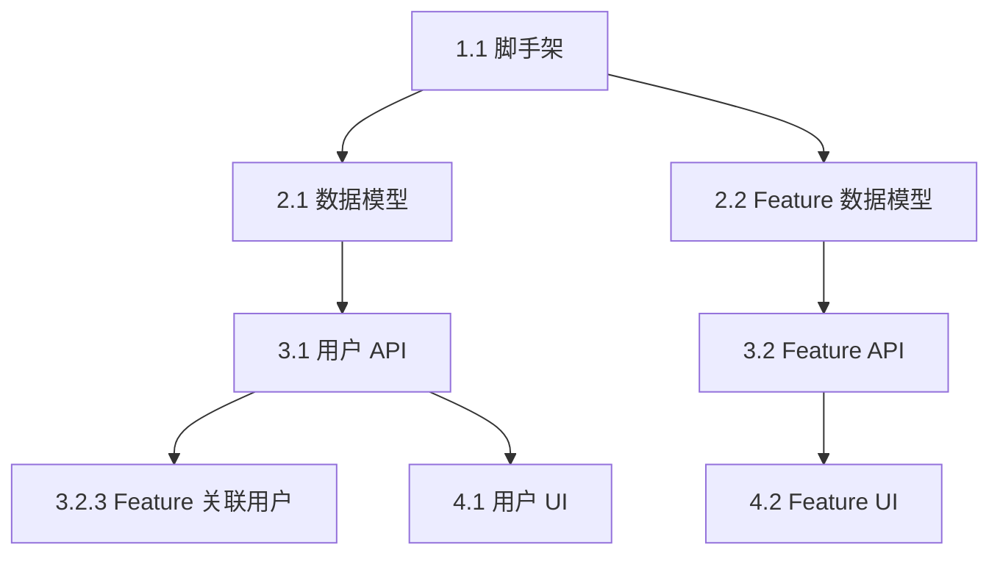

# Technical Task Breakdown

从技术方案和 Feature Spec 拆解出可执行的原子开发任务，构建 WBS、识别依赖、规划 Waves。

## 核心理念

一个 Feature Spec 可能包含 5-20 个原子开发任务。任务拆解的目标是：
1. **可执行** — 每个任务有明确的输入、输出、验收标准
2. **可并行** — 识别无依赖的任务，最大化并行度
3. **可估算** — 每个任务粒度适中，可准确估算工作量
4. **可追踪** — 任务可追溯到 Feature Spec 和技术方案

## 输入

- `.csp/tech-design/` — 技术方案设计产物
- `.csp/specs/` — Feature Spec 产物
- `.csp/decomposition/DEPENDENCY-GRAPH.md` — Feature 依赖图
- `.csp/tech-decisions/` — 技术选型

## 执行流程

### Phase 1: 任务识别

从技术方案和 Feature Spec 中识别所有原子任务。按照技术分层提取：

```markdown
## 任务识别维度

### 基础设施/环境类
- 项目脚手架搭建
- CI/CD 流水线配置
- 开发环境配置 (Docker Compose)
- 环境变量/Secrets 管理

### 数据层
- 数据库 Migration (CREATE TABLE)
- 索引创建
- 种子数据/测试数据
- 数据迁移脚本

### 后端 API 层
- 路由定义
- Schema/Model 定义
- Service 层业务逻辑
- Repository 层数据访问
- 中间件 (认证/日志/限流)
- 单元测试
- 集成测试

### 前端 UI 层
- 组件开发
- 页面/路由
- 状态管理 (Hooks/Store)
- API 对接
- 表单验证
- 单元测试
- E2E 测试

### 集成层
- WebSocket 配置
- 消息队列配置
- 外部服务集成
- 文件/对象存储配置

### 质量保障
- Lint 规则配置
- 安全扫描
- 性能测试
- 文档编写
```

### Phase 2: WBS 结构定义

采用标准 WBS 编号体系：

```
1.0 基础设施
  1.1 项目脚手架
  1.2 数据库初始化
  1.3 CI/CD 配置
  1.4 环境配置

2.0 数据层
  2.1 用户数据模型
    2.1.1 users 表 Migration
    2.1.2 用户索引创建
    2.1.3 用户种子数据
  2.2 Feature 数据模型
    ...

3.0 后端 API
  3.1 用户 API
    3.1.1 用户路由定义
    3.1.2 用户 Schema 定义
    3.1.3 用户 Service 实现
    3.1.4 用户 Repository 实现
    3.1.5 用户 API 测试
  3.2 Feature API
    ...
```

### Phase 3: 任务卡片定义

每个任务生成标准任务卡片：

```markdown
### Task 3.1.3: 用户 Service 实现

**WBS:** 3.1.3
**Feature:** F-A-1 (用户注册/登录)
**来源 Spec:** SPEC-F-A-1.md Section 4 (Backend Architecture)
**优先级:** P0
**预估工时:** 3h
**复杂度:** Medium

**描述:**
实现 UserService 的业务逻辑层，包括用户注册、登录、密码重置。

**技术要点:**
- 密码使用 bcrypt 哈希
- JWT 生成逻辑
- 注册后发送验证邮件(异步)

**涉及文件:**
- Create: src/users/service.py
- Modify: src/users/__init__.py
- Create: src/users/events.py

**依赖:**
- 2.1.1 (users 表 Migration) — 必须先完成
- 2.1.2 (用户索引) — 必须先完成

**阻塞:**
- 3.1.5 (用户 API 测试) — 依赖本任务

**验收标准:**
- [ ] register() 方法正确创建用户并返回 JWT
- [ ] login() 方法验证密码并返回 JWT
- [ ] reset_password() 生成重置 token 并发送邮件
- [ ] 所有方法有对应单元测试，覆盖率 ≥ 80%

**测试文件:**
- Create: src/users/tests/test_service.py
```

### Phase 4: 依赖 DAG 与 Waves 划分

```markdown
## 依赖图 (Mermaid)



## Waves 划分

### Wave 1: 基础设施 + 数据层 (Day 1-2)
并行组: 1.1, 1.2, 1.3, 1.4
| Task | WBS | 工时 | 执行者 |
|------|-----|------|--------|
| 项目脚手架 | 1.1 | 2h | A |
| 数据库初始化 | 1.2 | 1h | A |
| CI/CD 配置 | 1.3 | 3h | B |
| 环境配置 | 1.4 | 1h | A |

### Wave 2: 数据模型 (Day 2-3)
串行依赖 Wave 1, 内部可并行: 2.1, 2.2, 2.3
| Task | WBS | 工时 | 依赖 |
|------|-----|------|------|
| users 表 Migration | 2.1.1 | 0.5h | 1.2 |
| users 索引 | 2.1.2 | 0.5h | 2.1.1 |
| features 表 Migration | 2.2.1 | 0.5h | 1.2 |

### Wave 3: 后端 API (Day 3-7)
| Task | WBS | 工时 | 依赖 |
|------|-----|------|------|
| 用户路由 | 3.1.1 | 1h | 2.1 |
| 用户 Schema | 3.1.2 | 1h | 2.1 |
| 用户 Service | 3.1.3 | 3h | 3.1.2 |
| 用户 Repository | 3.1.4 | 2h | 2.1 |
| 用户 API 测试 | 3.1.5 | 2h | 3.1.3, 3.1.4 |

### Wave 4: 前端 UI (Day 5-10)
| Task | WBS | 工时 | 依赖 |
|------|-----|------|------|
| 用户登录页 | 4.1.1 | 3h | 3.1.3 |
| 用户注册页 | 4.1.2 | 3h | 3.1.3 |
| Feature 列表页 | 4.2.1 | 4h | 3.2.3 |

### Wave 5: 集成测试 + 优化 (Day 10-12)
| Task | WBS | 工时 | 依赖 |
|------|-----|------|------|
| E2E 测试 | 5.1 | 4h | Wave 4 |
| 性能优化 | 5.2 | 3h | Wave 4 |
| 文档更新 | 5.3 | 2h | Wave 4 |
```

### Phase 5: 关键路径与风险评估

```markdown
## 关键路径

```
1.1 (2h) → 1.2 (1h) → 2.1 (2h) → 3.1 (8h) → 4.1 (6h) → 5.1 (4h)
Total: 23h (约 3 个工作日，单人)
```

## 并行机会

```
Wave 1: 4 个任务可并行 → 最大并行度 4
Wave 2: 3 个数据模型可并行 (2.1, 2.2, 2.3)
Wave 3: 用户 API 和 Feature API 可并行
Wave 4: 5 个前端页面可并行
```

## 风险缓冲

| 风险 | 概率 | 影响 | 缓冲时间 |
|------|------|------|---------|
| 数据模型变更 | 中 | 2h | +0.5d |
| 第三方 API 延迟 | 低 | 4h | +0.5d |
| 未知技术难点 | 中 | 4h | +1d |

**总缓冲:** 2 天
**预计总工期:** 12 个工作日（含缓冲）
```

### Phase 6: 并行执行策略

```markdown
## 并行执行策略

### 团队配置 (假设 3 人)
- 成员 A: 全栈 (后端为主)
- 成员 B: 前端
- 成员 C: 全栈 (基础设施 + 测试)

### 分配方案

| Wave | 成员 A | 成员 B | 成员 C |
|------|--------|--------|--------|
| Wave 1 | 脚本 + 脚手架 | (等待) | CI/CD + 环境 |
| Wave 2 | users 数据模型 | 学习项目 | features 数据模型 |
| Wave 3 | 用户 API | (等待) | Feature API |
| Wave 4 | (支持) | 所有前端页面 | (支持) |
| Wave 5 | 性能优化 | E2E 测试 | 文档 |
```

### Phase 7: 输出产物

```
.csp/tasks/
├── WBS.md                    # 工作分解结构
├── TASK-CARDS/               # 每个任务的详细卡片
│   ├── TASK-1.1.md
│   ├── TASK-2.1.1.md
│   └── ...
├── DEPENDENCY-DAG.md         # 依赖 DAG + Mermaid 图
├── WAVES-PLAN.md             # Waves 划分 + 并行策略
├── CRITICAL-PATH.md          # 关键路径分析
├── SPRINT-BACKLOG.md         # Sprint Backlog (可导入 Jira/Linear)
└── TASK-BREAKDOWN-SUMMARY.md # 拆解摘要
```

## 拆解粒度指南

| 任务类型 | 建议工时 | 示例 |
|---------|---------|------|
| Migration | 0.5-1h | 创建一张表 |
| Schema/Model | 1-2h | 定义 API Schema |
| Service 逻辑 | 2-4h | 一个业务方法 |
| 前端组件 | 2-4h | 一个页面/复杂组件 |
| 测试 | 1-3h | 一个模块的测试 |
| 配置/脚本 | 0.5-2h | CI/CD 配置 |

**粒度原则:**
- 每个任务 ≤ 4h 工时（超过则继续拆分）
- 每个任务可独立完成和验证
- 每个任务产出可 Git 提交

## 完成信号

```yaml
completion_signal:
  output: .csp/tasks/TASK-BREAKDOWN-SUMMARY.md
  next_step:
    recommended: csp-effort-estimation
    alternatives: [csp-implementation-phase, csp-full]
  status:
    tasks_path: .csp/tasks/
    total_tasks: "{{count}}"
    total_hours: "{{hours}}"
    estimated_days: "{{days}}"
    phase: plan
    ready_for: [sprint-planning, implementation]
```

## 关键原则

1. **任务粒度 ≤ 4h** — 超过 4h 的任务隐含未知复杂度，必须拆分
2. **每个任务有明确产出** — 可提交的代码变更或可验证的中间产物
3. **依赖必须显式标注** — 不假设"大家都知道"的依赖关系
4. **并行优先** — 尽可能让更多任务并行，缩短总工期
5. **缓冲真实** — 不低估，每个 Wave 末尾加 20% 缓冲